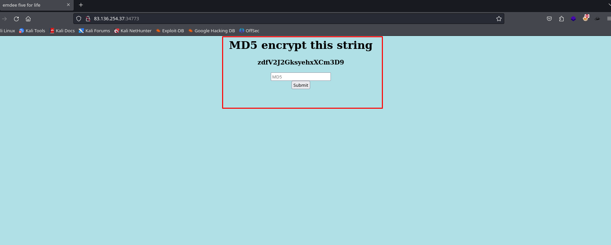
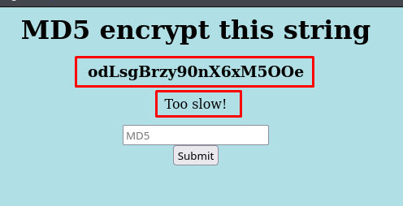
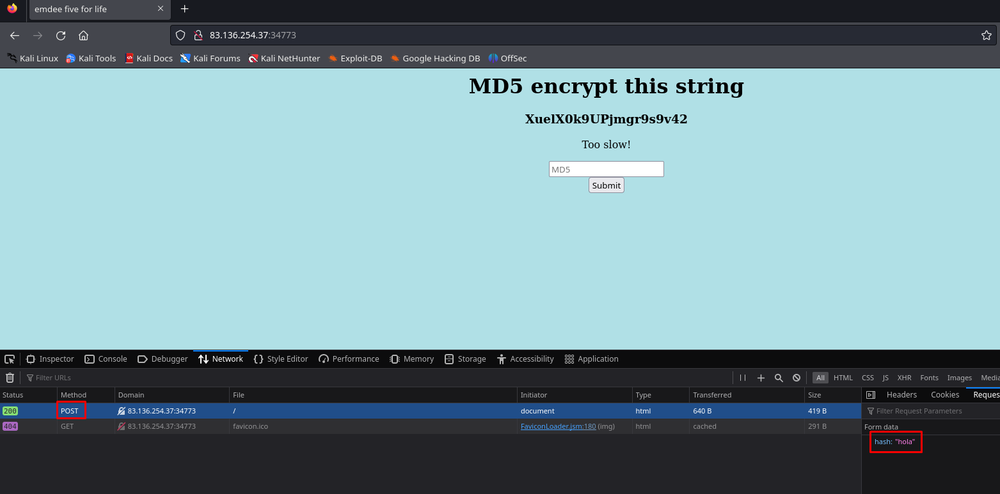
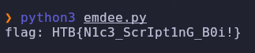

# (Misc) [Easy] Emdee five for life
## Autor: David Chaparro - davidch09

## Contexto

>Can you encrypt fast enough?

## Solución

En la web desplegada podemos ver una cadena de caracteres que supones que tenemos que encriptar en cifrado `MD5` y previamente oprimir el botón `Submit`



Hasheamos la cadena con el comando:

```bash
echo -n 'zdfV2J2GksyehxXCm3D9' | md5sum
8adf7e84903c984ef7f6964cc7610594
```



Pero cuando lo ingresamos, dice que lo hicimos muy lento y nos da una nueva cadena.

Viendo las peticiones de la página, vemos que el hash se manda en un `POST`.

También podemos ver que la página maneja una `cookie`



Si la idea es rapidez, tenemos que hacer un script para enviar la cadena hasheada lo más rápido posible, necesitamos:

1. Obtener la respuesta de la página
2. Extraer la cadena
3. Hashear la cadena en `MD5`
4. Enviar el hash en POST
5. Obtener la respuesta y extraer la flag

Para esto, codeamos el siguiente script en python que nos permite obtener la flag:

```python
import requests
from bs4 import BeautifulSoup
import hashlib

flag = 'Too slow!'

while flag == 'Too slow!':

    sesion = requests.session()

    response = sesion.get('http://83.136.254.11:35382/')
    lineaHash = response.text.split("\n")[5]

    soup = BeautifulSoup(lineaHash, 'html.parser')

    cadena = soup.find('h3').text

    hash = hashlib.md5(cadena.encode()).hexdigest()

    data = {'hash':hash}

    response = sesion.post('http://83.136.254.11:35382/', data=data)

    soup = BeautifulSoup(response.text, 'html.parser')

    flag = soup.find('p').text

print("flag: "+flag)
```

### Explicación del código

Para realizar las peticiones `GET` Y `POST`, usamos la librería `requests` de python, y para conservar la cookie, utilizamos la función `session`.

Para cifrar la cadena en `MD5` utilizamos la librería hashlib.

Y para extraer la cadena de caracteres y la flag usamos la librería `BeautifulSoup`, que tiene funciones para buscar elementos `html`, como `h3` o `p`.



Cuando ejecutamos el script obtenemos la flag!! 🐇
