# (Hardware) [Medium] The PROM
## Author: David Chaparro - davidch09

#### Requirements (Don't have to be an expert, just need to know the concept)

##### Topics
+ Linux
+ EEPROM chips
+ Basic circuit knowledge

##### Tools
+ pwn tools
+ netcat

##### Languages / Ciphering
+ bash
+ python
+ Binary

## Context

>After entering the door, you navigate through the building, evading guards, and quickly locate the server room in the basement. Despite easy bypassing of security measures and cameras, laser motion sensors pose a challenge. They're controlled by a small 8-bit computer equipped with AT28C16 a well-known EEPROM as its control unit. Can you uncover the EEPROM's secrets?

## Solution

After stablish connection with `netcat`, it seems to be a simulator of an `"AT28C16"` EEPROMs chip.

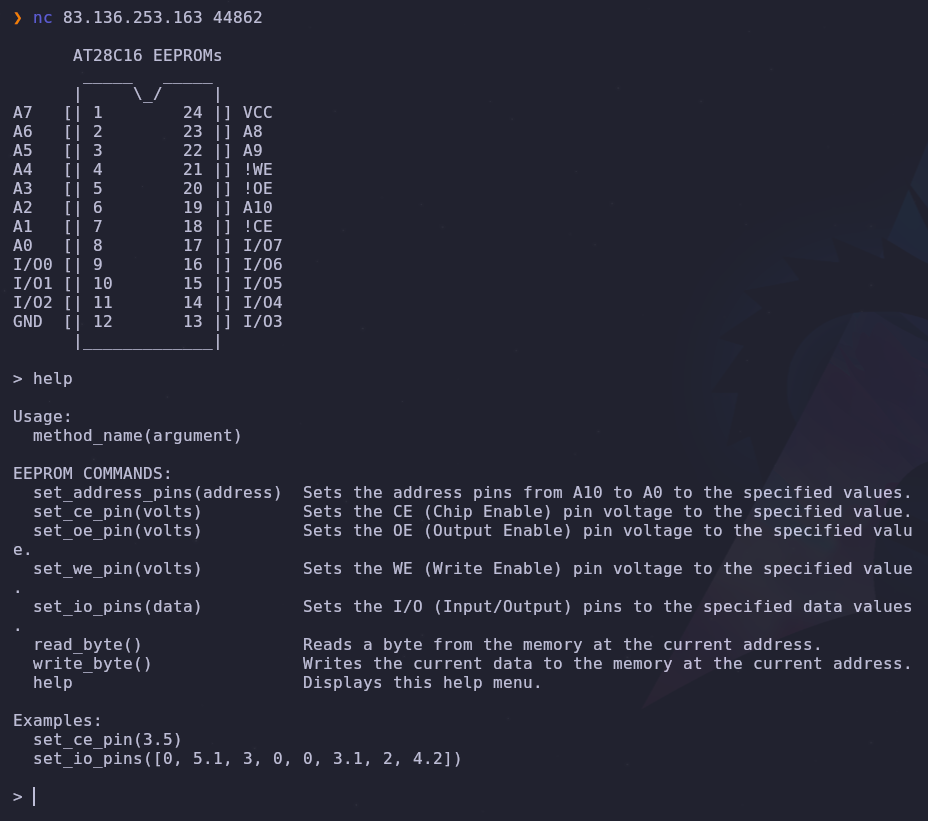

There are 7 relevant methods (excluding the one that prints the help menu), maybe the flag is written in the memory of the chip and we have to read it, let's try the `read_byte()` method:

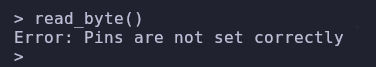

Hmmm, we have to configure the pins first, let's search the chip's manual on the web, because I don't have any idea of which pins have to be on.

+ Manual: http://cva.stanford.edu/classes/cs99s/datasheets/at28c16.pdf

I found it! and after some reading, this part shows us how to put the chip into `read mode`:

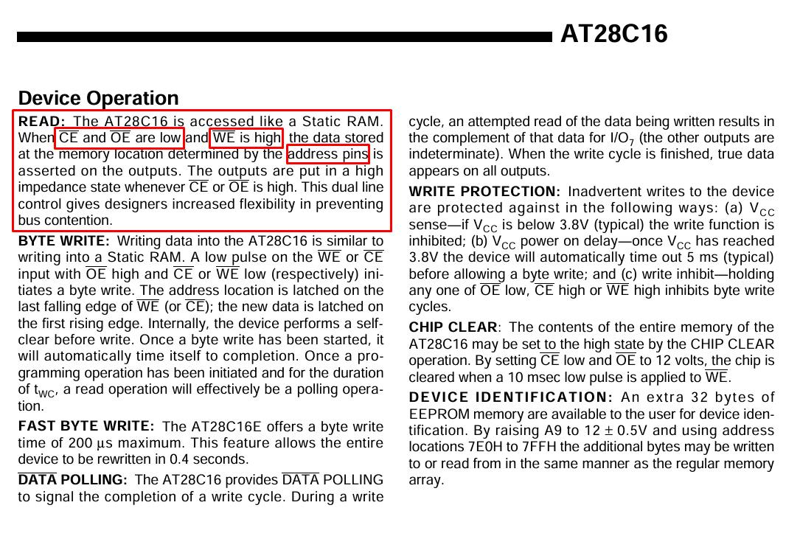

All right! we have to put the `CE`, `OE` pins low and `WE` high. Also, we have to stablish the address pins correctly to read the correct memory location, in the first page we can see that the chip have a 16k memory organized as `2048` words by 8 bits, that's why there are `11` (2^11 = 2048) address pins (from A0 to A10) 

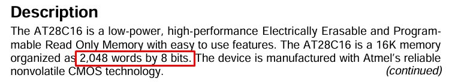

Normally, low means `"0 volts"` and high `"5 volts"`, but to be sure, we can look at the the limit voltages at page `4`:

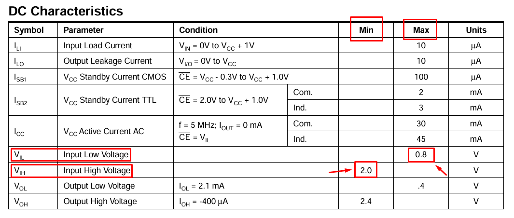

Okay, let's try to put the correct voltage (that doesn't pass the limits) in each pin, and two different addresses:

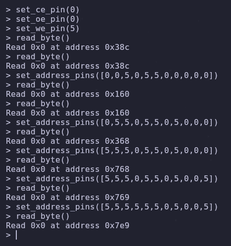

Nice!! we are reading the content in memory, also we discovered that `A10` pin is the most significant one (Big Endian - From left to right). But, the sad thing is that all the values we are reading are nothing (`0x0`), the flag is somewhere in the memory? we have to write in memory too?

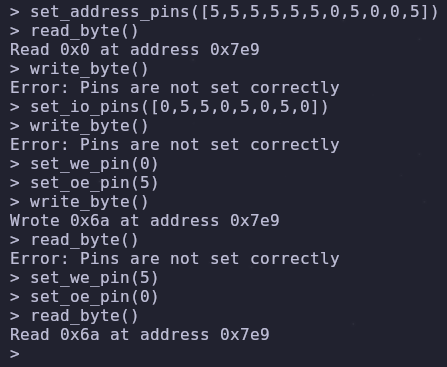

We can write memory too! but, if we think about it, It doesn't seem to help us

Let's try reading all the memory, and get each register, so if there is some value that is not null, we can get it

To do this, we can use `pwn tools`, it is an excellent python library for analyzing and exploiting binaries, but in this case, is so useful to send lines in loop through our terminal. 

We made this payload, that checks the content on every register (sending an address of a 11 position binary code, but replacing the `1's` with `5's`)

```python
from pwn import *

c = remote("94.237.59.63", 40548)
c.sendline('set_ce_pin(0)'.encode())
c.sendline('set_oe_pin(0)'.encode())
c.sendline('set_we_pin(5)'.encode())

for i in range(0, 2048):
    numero_binario = bin(i)
    numero_binario = (numero_binario[2:]).zfill(11)
    lista_numero = list(numero_binario)
    direccion_string = ','.join(map(str, lista_numero))
    direccion = ('[' + direccion_string + ']').replace("1", "5")
    c.sendline(f'set_address_pins({direccion})'.encode())
    c.sendline('read_byte()'.encode())

    print(c.recv().decode())
```

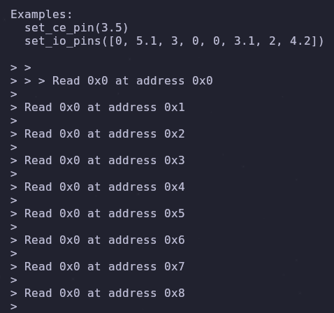

Yes! It works, now let's compare each register, to see if someone have something, we add the comparison at the end, in the loop:

```python
from pwn import *

c = remote("94.237.59.63", 40548)
c.sendline('set_ce_pin(0)'.encode())
c.sendline('set_oe_pin(0)'.encode())
c.sendline('set_we_pin(5)'.encode())

for i in range(0, 2048):
    numero_binario = bin(i)
    numero_binario = (numero_binario[2:]).zfill(11)
    lista_numero = list(numero_binario)
    direccion_string = ','.join(map(str, lista_numero))
    direccion = ('[' + direccion_string + ']').replace("1", "5")
    c.sendline(f'set_address_pins({direccion})'.encode())
    c.sendline('read_byte()'.encode())

    resultado = c.recv().decode()

    if "Read 0x0" in resultado:
        pass
    else:
        print("flag? "+"en la linea: "+resultado)
```

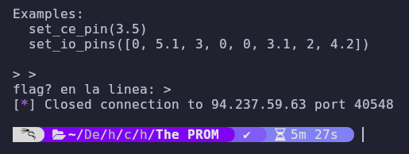

**Nothing**, it only shows us the initial menu, but now we are sure that there is nothing written in memory

After some headaches and researching, I looked back the manual and found something interesting...

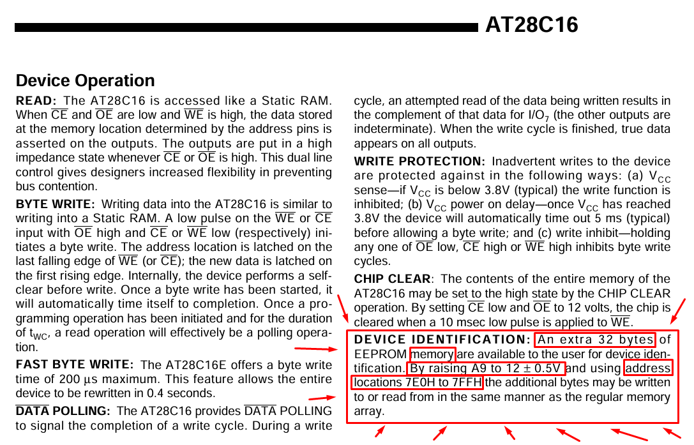

**THERE IS A SECRET DEVICE IDENTIFICATION WRITTEN IN THE MEMORY IF WE RAISING A PIN TO `12V`!!!!**

*(I'm angry, because I didn't read that before)*

This is it, it has to be, let's configure the payload to send `12` voltage to  the `A9` pin, and only for reading from position `7E0` to `7FF` (`2016` to `2048`):

After fix some errors, debugging and decoration, I had to restructure the payload in order to pass the first line (avoiding the menu). But here it is, the final payload:

```python
from pwn import *
from tqdm import tqdm

c = remote("94.237.59.63", 40548)
c.sendline('set_ce_pin(0)'.encode())
c.sendline('set_oe_pin(0)'.encode())
c.sendline('set_we_pin(5)'.encode())
flag = ''

with tqdm(total=32) as barra:
    for i in range(2016, 2048):
        numero_binario = bin(i)
        numero_binario = numero_binario.replace("1", "5")
        numero_binario = numero_binario[2:]
        lista_numero = list(numero_binario)
        lista_numero[1] = 12
        direccion_string = ','.join(map(str, lista_numero))
        direccion = '[' + direccion_string + ']'
        c.sendline(f'set_address_pins({direccion})'.encode())
        c.wait(0.5)
        c.sendline('read_byte()'.encode())
        c.wait(0.5)

        if i == 2016:
            texto_inicial = c.recv().decode()
            resultado_string = texto_inicial[texto_inicial.index("Read "):]
            resultado_hex = resultado_string.split()[1]
            resultado = chr(int(resultado_hex, 16))
            flag += resultado
        else:
            resultado_hex = c.recv().decode().split()[2]
            resultado = chr(int(resultado_hex, 16))
            flag += resultado
        barra.update()

print("FLAG: " + flag)
```
*I had to put the `wait()` methods, because of network latency*

And finally!!! we got our precious flag 🐇:

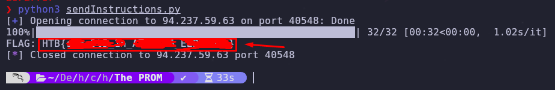


