# (Linux) [Easy] GreenHorn
## Autor: David Chaparro - davidch09

## Solución

Empezamos enumerando los puertos disponibles, con los comandos:

```sh
sudo nmap -p- -sS -Pn --min-rate 5000 -vvv -n -oG allPorts.txt 10.129.231.80
```
```sh
sudo nmap -p 22,80,3000 -Pn -sVC --min-rate 5000 -oN puertos.txt 10.129.231.80
```
Y obtenemos este resultado:

```java
PORT     STATE SERVICE VERSION
22/tcp   open  ssh     OpenSSH 8.9p1 Ubuntu 3ubuntu0.10 (Ubuntu Linux; protocol 2.0)
| ssh-hostkey: 
|   256 57:d6:92:8a:72:44:84:17:29:eb:5c:c9:63:6a:fe:fd (ECDSA)
|_  256 40:ea:17:b1:b6:c5:3f:42:56:67:4a:3c:ee:75:23:2f (ED25519)
80/tcp   open  http    nginx 1.18.0 (Ubuntu)
|_http-title: Did not follow redirect to http://greenhorn.htb/
|_http-server-header: nginx/1.18.0 (Ubuntu)
3000/tcp open  ppp?
| fingerprint-strings: 
|   GenericLines, Help, RTSPRequest: 
|     HTTP/1.1 400 Bad Request
|     Content-Type: text/plain; charset=utf-8
|     Connection: close
|     Request
|   GetRequest: 
|     HTTP/1.0 200 OK
|     Cache-Control: max-age=0, private, must-revalidate, no-transform
|     Content-Type: text/html; charset=utf-8
|     Set-Cookie: i_like_gitea=12be449dc2d6bf46; Path=/; HttpOnly; SameSite=Lax
|     Set-Cookie: _csrf=77UBmaghEcC6kMITKN-lmg1DgoQ6MTcyNTkyNTU4NzgyNjY4MDUxMg; Path=/; Max-Age=86400; HttpOnly; SameSite=Lax
|     X-Frame-Options: SAMEORIGIN
|     Date: Mon, 09 Sep 2024 23:46:27 GMT
|     <!DOCTYPE html>
|     <html lang="en-US" class="theme-auto">
|     <head>
|     <meta name="viewport" content="width=device-width, initial-scale=1">
|     <title>GreenHorn</title>
|     <link rel="manifest" href="data:application/json;base64,eyJuYW1lIjoiR3JlZW5Ib3JuIiwic2hvcnRfbmFtZSI6IkdyZWVuSG9ybiIsInN0YXJ0X3VybCI6Imh0dHA6Ly9ncmVlbmhvcm4uaHRiOjMwMDAvIiwiaWNvbnMiOlt7InNyYyI6Imh0dHA6Ly9ncmVlbmhvcm4uaHRiOjMwMDAvYXNzZXRzL2ltZy9sb2dvLnBuZyIsInR5cGUiOiJpbWFnZS9wbmciLCJzaXplcyI6IjUxMng1MTIifSx7InNyYyI6Imh0dHA6Ly9ncmVlbmhvcm4uaHRiOjMwMDAvYX
|   HTTPOptions: 
|     HTTP/1.0 405 Method Not Allowed
|     Allow: HEAD
|     Allow: HEAD
|     Allow: GET
|     Cache-Control: max-age=0, private, must-revalidate, no-transform
|     Set-Cookie: i_like_gitea=e01b43bde3ef28f0; Path=/; HttpOnly; SameSite=Lax
|     Set-Cookie: _csrf=03xK5sQU95Pyy16vDA1zPeoBOlA6MTcyNTkyNTU5NDUxNjk4MjkyNA; Path=/; Max-Age=86400; HttpOnly; SameSite=Lax
|     X-Frame-Options: SAMEORIGIN
|     Date: Mon, 09 Sep 2024 23:46:34 GMT
|_    Content-Length: 0
1 service unrecognized despite returning data. If you know the service/version, please submit the following fingerprint at https://nmap.org/cgi-bin/submit.cgi?new-service :
SF-Port3000-TCP:V=7.94SVN%I=7%D=9/9%Time=66DF88D3%P=x86_64-pc-linux-gnu%r(
SF:GenericLines,67,"HTTP/1\.1\x20400\x20Bad\x20Request\r\nContent-Type:\x2
SF:0text/plain;\x20charset=utf-8\r\nConnection:\x20close\r\n\r\n400\x20Bad
SF:\x20Request")%r(GetRequest,252E,"HTTP/1\.0\x20200\x20OK\r\nCache-Contro
SF:l:\x20max-age=0,\x20private,\x20must-revalidate,\x20no-transform\r\nCon
SF:tent-Type:\x20text/html;\x20charset=utf-8\r\nSet-Cookie:\x20i_like_gite
SF:a=12be449dc2d6bf46;\x20Path=/;\x20HttpOnly;\x20SameSite=Lax\r\nSet-Cook
SF:ie:\x20_csrf=77UBmaghEcC6kMITKN-lmg1DgoQ6MTcyNTkyNTU4NzgyNjY4MDUxMg;\x2
SF:0Path=/;\x20Max-Age=86400;\x20HttpOnly;\x20SameSite=Lax\r\nX-Frame-Opti
SF:ons:\x20SAMEORIGIN\r\nDate:\x20Mon,\x2009\x20Sep\x202024\x2023:46:27\x2
SF:0GMT\r\n\r\n<!DOCTYPE\x20html>\n<html\x20lang=\"en-US\"\x20class=\"them
SF:e-auto\">\n<head>\n\t<meta\x20name=\"viewport\"\x20content=\"width=devi
SF:ce-width,\x20initial-scale=1\">\n\t<title>GreenHorn</title>\n\t<link\x2
SF:0rel=\"manifest\"\x20href=\"data:application/json;base64,eyJuYW1lIjoiR3
SF:JlZW5Ib3JuIiwic2hvcnRfbmFtZSI6IkdyZWVuSG9ybiIsInN0YXJ0X3VybCI6Imh0dHA6L
SF:y9ncmVlbmhvcm4uaHRiOjMwMDAvIiwiaWNvbnMiOlt7InNyYyI6Imh0dHA6Ly9ncmVlbmhv
SF:cm4uaHRiOjMwMDAvYXNzZXRzL2ltZy9sb2dvLnBuZyIsInR5cGUiOiJpbWFnZS9wbmciLCJ
SF:zaXplcyI6IjUxMng1MTIifSx7InNyYyI6Imh0dHA6Ly9ncmVlbmhvcm4uaHRiOjMwMDAvYX
SF:")%r(Help,67,"HTTP/1\.1\x20400\x20Bad\x20Request\r\nContent-Type:\x20te
SF:xt/plain;\x20charset=utf-8\r\nConnection:\x20close\r\n\r\n400\x20Bad\x2
SF:0Request")%r(HTTPOptions,1A4,"HTTP/1\.0\x20405\x20Method\x20Not\x20Allo
SF:wed\r\nAllow:\x20HEAD\r\nAllow:\x20HEAD\r\nAllow:\x20GET\r\nCache-Contr
SF:ol:\x20max-age=0,\x20private,\x20must-revalidate,\x20no-transform\r\nSe
SF:t-Cookie:\x20i_like_gitea=e01b43bde3ef28f0;\x20Path=/;\x20HttpOnly;\x20
SF:SameSite=Lax\r\nSet-Cookie:\x20_csrf=03xK5sQU95Pyy16vDA1zPeoBOlA6MTcyNT
SF:kyNTU5NDUxNjk4MjkyNA;\x20Path=/;\x20Max-Age=86400;\x20HttpOnly;\x20Same
SF:Site=Lax\r\nX-Frame-Options:\x20SAMEORIGIN\r\nDate:\x20Mon,\x2009\x20Se
SF:p\x202024\x2023:46:34\x20GMT\r\nContent-Length:\x200\r\n\r\n")%r(RTSPRe
SF:quest,67,"HTTP/1\.1\x20400\x20Bad\x20Request\r\nContent-Type:\x20text/p
SF:lain;\x20charset=utf-8\r\nConnection:\x20close\r\n\r\n400\x20Bad\x20Req
SF:uest");
Service Info: OS: Linux; CPE: cpe:/o:linux:linux_kernel
```

Tenemos 3 puertos abiertos, en el 22 `SSH` y en el 80 y 3000, dos servicios `web`, empecemos analizando los servicios web:

### Enumeración servicio web puerto 80

En el puerto `80` (usado para el servicio `http`) podemos ver que nos redirige a la dirección `greenhorn.htb`, pero no lo hace de manera correcta, para que lo haga, necesitamos poner la dirección de esta manera en el path de nuestra máquina `/etc/hosts`:

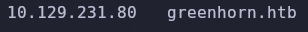  

Observamos que es una especie de sitio web para aprender desarrollo web. Haciendo `Hovering`, descubrimos una página para loguearse como administrador, y también averiguamos que la web está montada con la versión `4.7.18` de `Pluck`, que es un CMS (content management system).

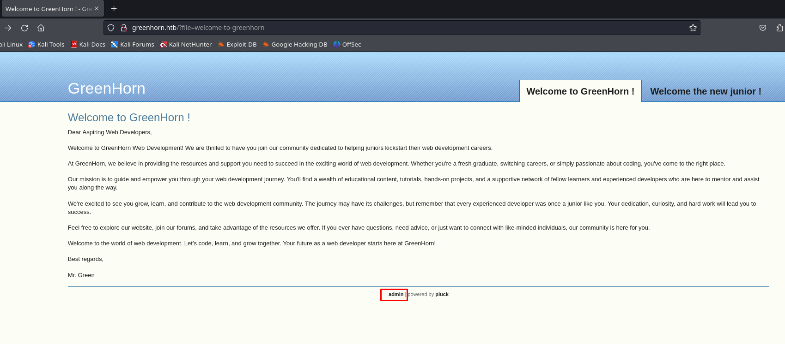 

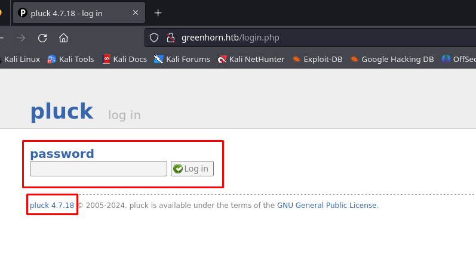 

Usando la herramienta `searchspolit`, vemos que esta versión tiene una vulnerabilidad para lograr `RCE` (remote command execution):

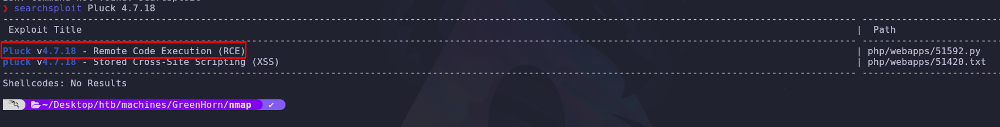 

Pero antes de intentar explotar esta vulnerabilidad, enumeremos el servicio web del otro puerto.

### Enumeración servicio web puerto 3000

Comúnmente, el puerto `3000` se utiliza cuando se alza un nuevo servidor de un proyecto de `React`, ahora analizando la página, haciendo `hovering` vemos que tiene un repositorio de git almacenado:

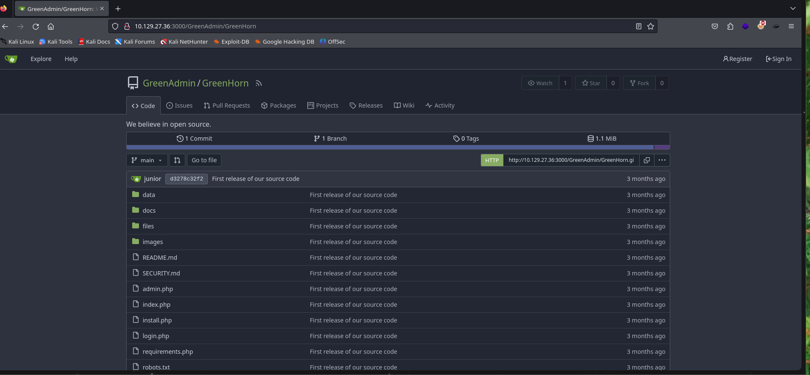 

Analizando la estructura del repositorio y del CMS `Pluck`, encontramos que en el archivo `login.pkp` se utiliza un hash almacenado en el archivo `data/settings/pass.php` que podría ser una contraseña

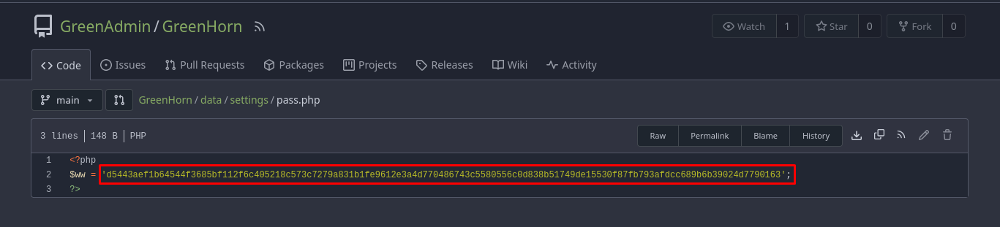 

Primero, intentemos identificar el tipo de hash con `hash-identifier`:


Vemos que podría ser un `SHA-512`

Intentemos descifrarlo a fuerza bruta con `hashcat`, primero vemos el código del cifrado para usar en el comando:

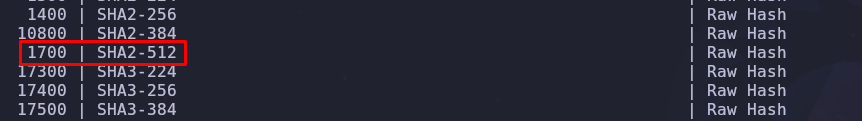

Ahora, con el diccionario `rockyou.txt`, construimos y ejecutamos el comando:

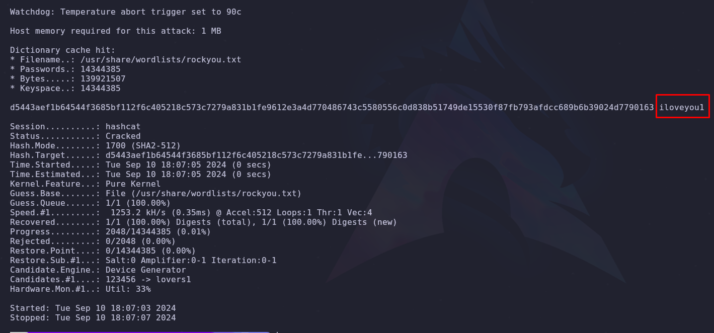

### Intrusión y explotación 

Tenemos la contraseña! y logramos ingresar al panel admin del servicio web del puerto `80`, en el que previamente habíamos identificado una vulnerabilidad en la versión del CMS `Pluck` asociada con el CVE: `2023-50564`

Esta vulnerabilidad permite la subida de archivos arbitrariamente, como módulos almacenados en un `.zip`, y por ende la posibilidad de subir una `reverse shell`. Entonces, subimos un archivo comprimido con una reverse shell php de: https://github.com/pentestmonkey/php-reverse-shell

Ahora nos ponemos a la escucha usando `netcat`:

```sh
nc -nlvp 1234
```

Subimos el archivo

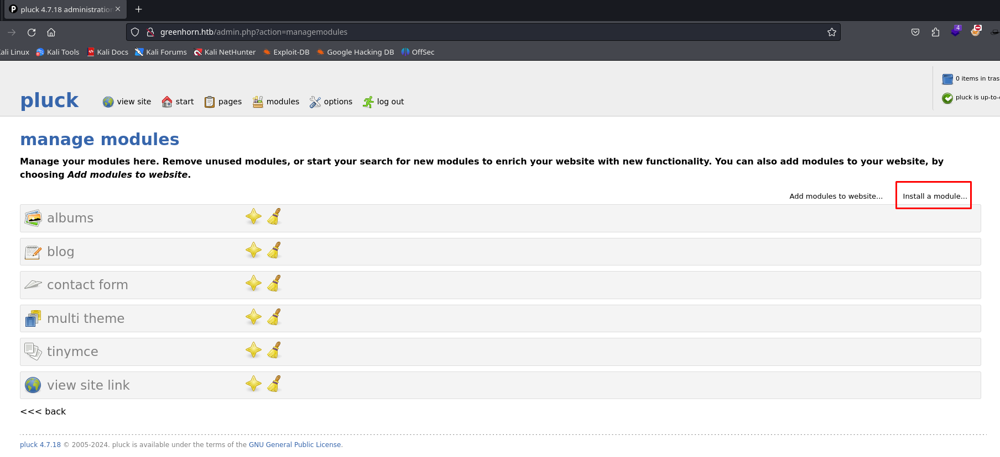

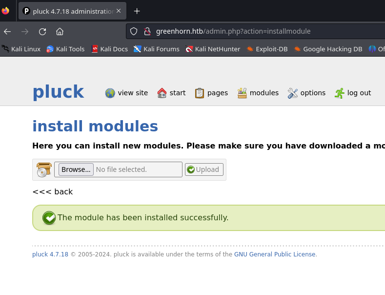

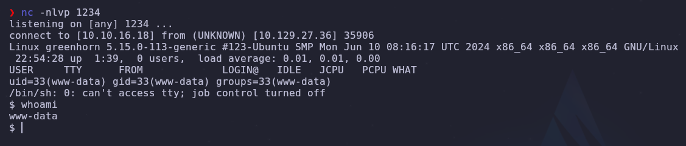

Y obtenemos la reverse shell!! (si no se obtiene automáticamente cuando se sube el .zip, se tiene que llamar al archivo desde el path: `/data/modules/shell/shell.php`)

### Movimiento lateral y escalación de privilegios

Después de sanitizar la terminal (Con ayuda de este tutorial: https://uqbarun.github.io/blog/fundamentos/2023/11/19/sanitizacion-de-tty-por-conexion-remota)

Nos damos cuenta que no podemos leer la flag `user.txt`, ya que tenemos que ser el usuario `junior`

Intentando la misma contraseña previamente descubierta, podemos cambiar de usuario a `junior`:

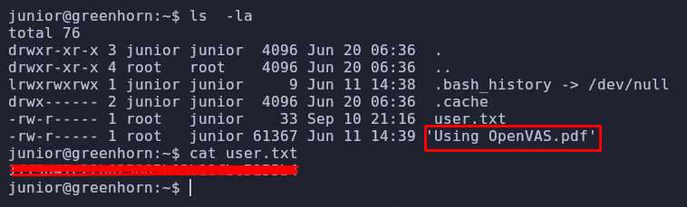 

Después de leer la flag de user, nos damos cuenta que hay un archivo PDF interesante. Lo pasamos a nuestra máquina abriendo un servidor web en python en la máquina atacante:

```sh
python3 -m http.server 7777
```

Y lo obtenemos en nuestra máquina usando `wget`:

```sh
wget http://10.129.27.36:7777/'Using OpenVAS.pdf'
open 'Using OpenVAS.pdf'
```

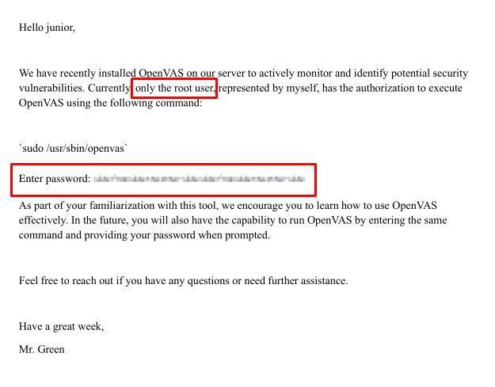 

Parece que es un manual para usar `OpenVAS`, y nos está mostrando una contraseña de root borrosa.

Después de buscar y utilizar varios filtros para aclarar la parte de la contraseña borrosa (para extraer solo la imagen borrosa, se le da click derecho y guardar imagen), solo quedan a la vista pixeles claros, por medio de una búsqueda con palabras claves como `recover` `pixel` `image` `github`, encontramos este repositorio de la herramienta `Depix`:

https://github.com/spipm/Depix

Y con el comando:

```sh
python3 depix.py \
    -p /home/kali/Desktop/htb/machines/GreenHorn/pixeled.png \             
    -s images/searchimages/debruinseq_notepad_Windows10_closeAndSpaced.png \
    -o /home/kali/Desktop/htb/machines/GreenHorn/password.png
```

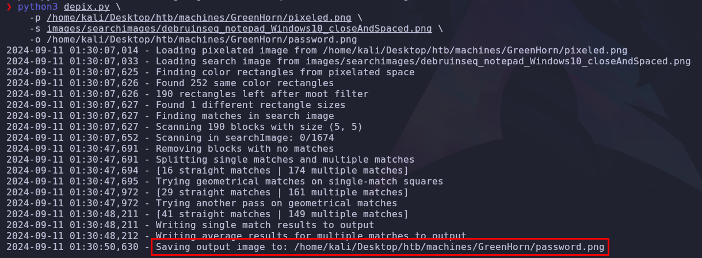

```sh
open password.png
```

Obtenemos esta imagen:


Que parece ser una cadena de caracteres con el siguiente contenido:

>sidefromsidetheothersidesidefromsidetheotherside

La probamos como contraseña para cambiar al usuario `root`:

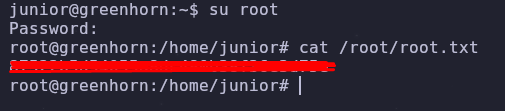

Y obtenemos la flag 🐇