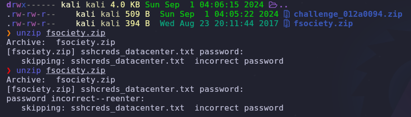
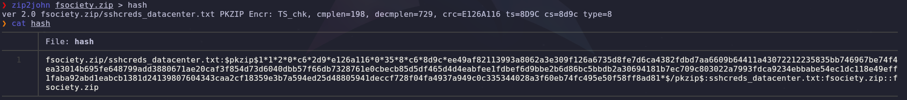
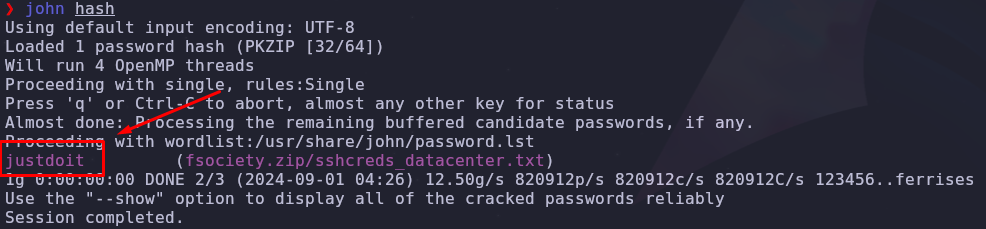
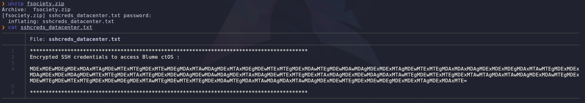
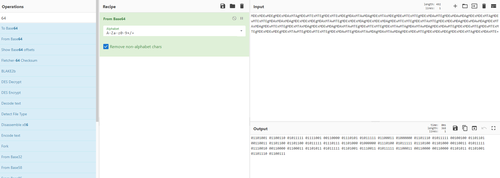
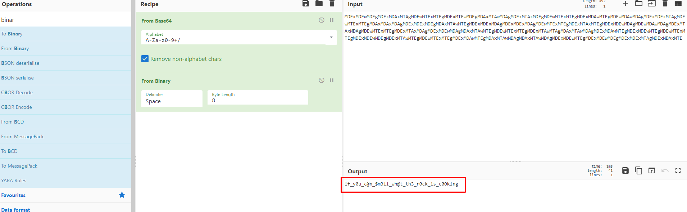

# (Misc) [Easy] Challenge 012A0094
## Author: David Chaparro - davidch09 <AuthorName>
## Points: 3 <points>

#### Requirements (Not an expert, only know the concept)

##### Topics
+ Cracking/Bruteforce passwords
+ Cryptography

##### Tools
+ zip2john
+ john

##### Languages / Ciphering
+ Base 64
+ Binary

## Context

>We believe that there is an SSH Password inside password protected 'ZIP' folder. Can you crack the 'ZIP' folder and get the SSH password?

## Solution

### Cracking ZIP's password
Firstly, we try obvious things like: try with an empty password or the name of the file as password.

Neither of them give us something, so let's try out extracting the hash of the zip in order to try to crack the password later, for this, we can use the useful tool `zip2john`, that gives us this hash:

Now, let's try cracking the hash using a really good bruteforcing tool named `john` (`zip2john` always give us a hash ready to crack with `john`):

Nice!!, we got the zip's password, we can use it to extract the content:

### Decrypting the content

jeez, that looks like an encoded message, but the last `=` character can tell us is a **base 64** cipher, we are gonna use https://cyberchef.io/ to analyze it:

This looks like **binary** code, after decoding it from binary, we get our precious flag 🐇:

