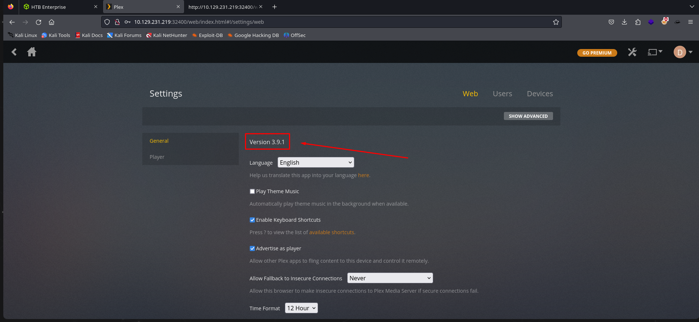
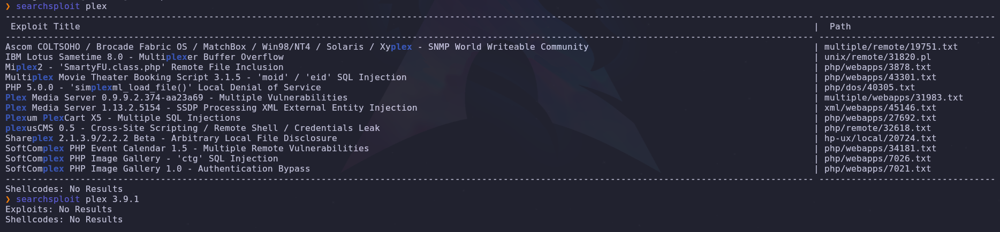
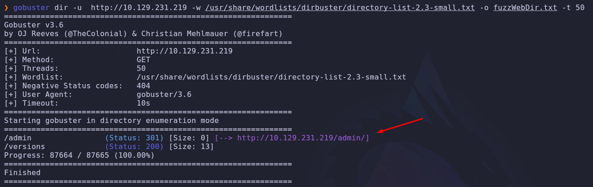
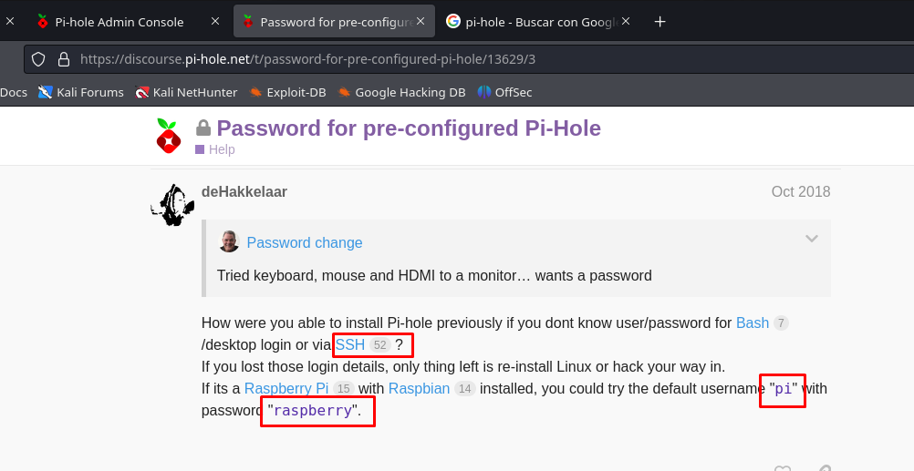
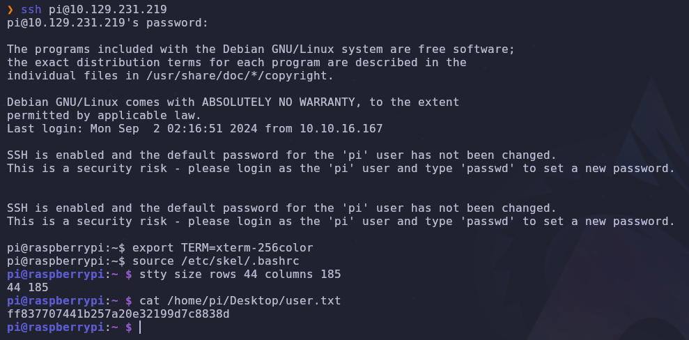
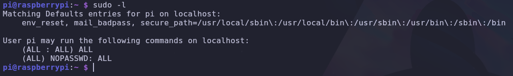
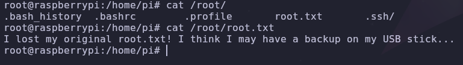
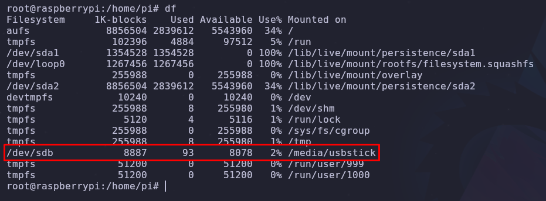
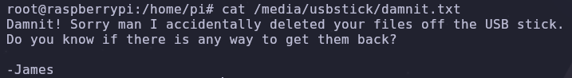
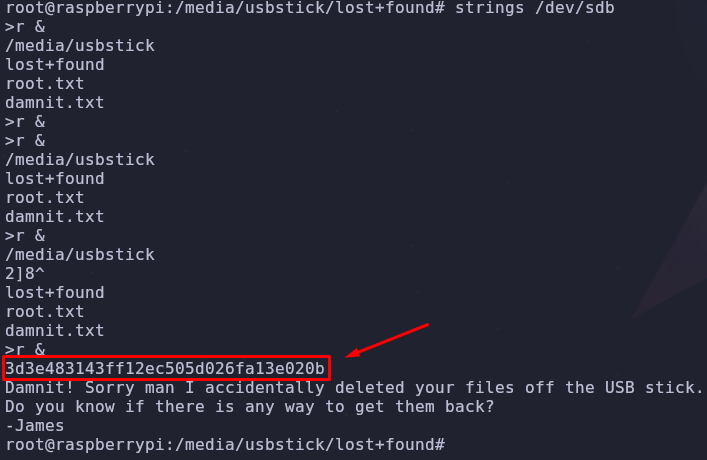

# (Linux) [Easy] Challenge 012A0094
## Author: David Chaparro - davidch09
## Points: User flag: 10 - System flag: 20

#### Requirements (Not an expert, only know the concept)

##### Topics
+ Linux
+ Port/Web enumeration

##### Tools
+ nmap
+ gobuster

##### Languages / Ciphering
+ bash

## Solution

### Ports Enumeration

We start with my prefer port enumeration, with the `nmap` command:

```sh
sudo nmap -p- -sS -Pn --min-rate 5000 -vvv -n -oG allPorts.txt 10.129.231.219
```

We discover these open ports:

```java
PORT      STATE SERVICE      REASON
22/tcp    open  ssh          syn-ack ttl 63
53/tcp    open  domain       syn-ack ttl 63
80/tcp    open  http         syn-ack ttl 63
1557/tcp  open  arbortext-lm syn-ack ttl 63
32400/tcp open  plex         syn-ack ttl 63
32469/tcp open  unknown      syn-ack ttl 63
```
We see that a web service is running in the port `80` and a service named `plex` running in the port `32400`. Now let's analyze deeper the services and versions with this command:

```sh
sudo nmap -p 22,53,80,1557,32400,32469 -Pn -sVC --min-rate 5000 -oN puertos.txt 10.129.231.219
```
#### parameters explanation
+ -p- : Scans all possible ports (1 - 65535)
+ -sS : (stealth Scan) Sends SYN packets and waits for a response, it's faster and stealthier than a full TCP scan
+ -Pn : no `ping` command is performed, so the scan was doing without checking if the machine responds to ICMP pings
+ --min-rate 5000 : Sets a minimum rate of `5000` packets per second (the more packets, the faster, but noisier and more detectable)
+ -vvv : More verbosity, you can see the ports discovering in the process
+ -n : Skips DNS resolution, speeding up the scan
+ -oG puertos.txt : Saves the scan results in a grepable format (easy to filter and use the `grep` command) in the file `"puertos.txt"`
+ 
  
```java
PORT      STATE SERVICE VERSION
22/tcp    open  ssh     OpenSSH 6.7p1 Debian 5+deb8u3 (protocol 2.0)
| ssh-hostkey: 
|   1024 aa:ef:5c:e0:8e:86:97:82:47:ff:4a:e5:40:18:90:c5 (DSA)
|   2048 e8:c1:9d:c5:43:ab:fe:61:23:3b:d7:e4:af:9b:74:18 (RSA)
|   256 b6:a0:78:38:d0:c8:10:94:8b:44:b2:ea:a0:17:42:2b (ECDSA)
|_  256 4d:68:40:f7:20:c4:e5:52:80:7a:44:38:b8:a2:a7:52 (ED25519)
53/tcp    open  domain  dnsmasq 2.76
| dns-nsid: 
|_  bind.version: dnsmasq-2.76
80/tcp    open  http    lighttpd 1.4.35
|_http-title: Site doesnt have a title (text/html; charset=UTF-8).
|_http-server-header: lighttpd/1.4.35
1557/tcp  open  upnp    Platinum UPnP 1.0.5.13 (UPnP/1.0 DLNADOC/1.50)
32400/tcp open  http    Plex Media Server httpd
|_http-favicon: Plex
|_http-cors: HEAD GET POST PUT DELETE OPTIONS
| http-auth: 
| HTTP/1.1 401 Unauthorized\x0D
|_  Server returned status 401 but no WWW-Authenticate header.
|_http-title: Unauthorized
32469/tcp open  upnp    Platinum UPnP 1.0.5.13 (UPnP/1.0 DLNADOC/1.50)
Service Info: OS: Linux; CPE: cpe:/o:linux:linux_kernel
```


### Web enumeration

Okay, after exploring the web services in both ports, we see that the one in the port `80` doesn't have anything (the main page is empty, but we can do directory/subdomain enumeration later) and in the `Plex` , because after sign in, we can see the version of the service: 



And after using `searchsploit`, it doesn't appear to be vulnerable:  



Now let's do a directory discovery with the tool `gobuster`, we start with the port `80` (it's the default one, so we don't have to specify the `:80` after the ip):

```sh
gobuster dir -u http://ipExample -w /usr/share/wordlists/dirbuster/directory-list-2.3-small.txt -o fuzzWebDir.txt -t 50 
```
#### parameters explanation
+ dir : This is the option to execute a `direction discovery` in `gobuster`
+ -u : Sets the ip of the we service
+ -w : Sets the wordlist dictionary to use in the bruteforcing process
+ -o : Save the content of the directory discovery
+ -t : Number of current threads the process will use (default: 10)



After discovering the `/admin` directory, where we find a login for the service `Pi-hole`, we could try a simple thing, looking for default credentials online, but after trying different passwords for the login that didn't work, we find credentials for a ssh login:



Let's try it:




And we are in!!, now we can see the user flag in `/home/pi/Desktop/user.txt` and sanitize the terminal (You can learn how to do it here 🐇: https://uqbarun.github.io/blog/fundamentos/2023/11/19/sanitizacion-de-tty-por-conexion-remota)

### Privileged escalation / Linux enumeration

Now we have to escalate privileges in order to be root, let's start with a simple enumeration with `sudo -l`:



wut? Apparently we can execute any commands with sudo, so we can use `sudo su` to become **root**:



It's not that easy uh? They gave us a hint though, in Linux we can verify devices with storage with the command `df`, also we can use `mount` (with this one we have to grep to reduce content, like this: `mount | grep "usb"`):



Inside the `/media/usbstick/` we can see the `"damnit.txt"` file:



He deleted it? Let's see the content inside `/dev/sdb` (we must use the command `strings`, because with `cat` the content is not printed human-readable)



And we got the flag!! 🐇


