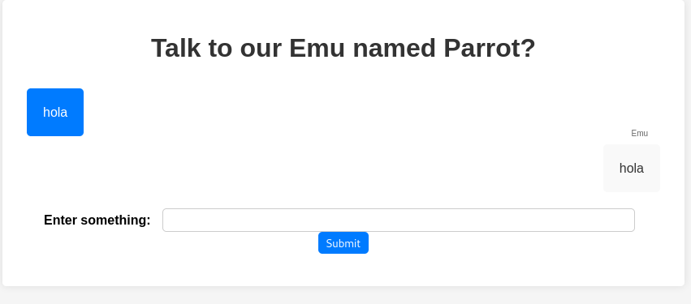
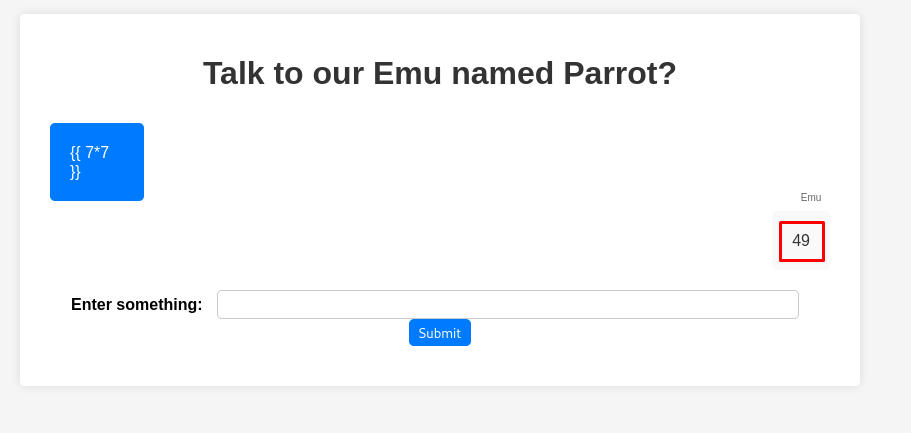
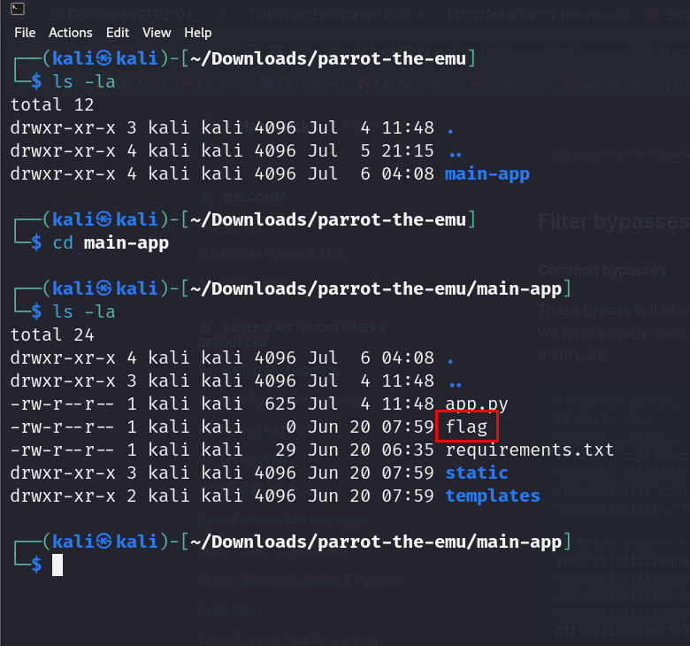

# [Beginner] parrot the emu <ChallengeName>
## Author: David Chaparro <AuthorName>
### Points: 100<points>

### Context

It is so nice to hear Parrot the Emu talk back

https://web-parrot-the-emu-4c2d0c693847.2024.ductf.dev 


### Solution

#### Requirements

+ Python
+ Flask
+ SSTI

#### Step 1
The link shows us a web application where we can talk and the server answers the same thing, so, we can try different kind of attacks, such as XSS, SSTI, SQLI or another type of injection

  


#### Step 2

With wappalyzer, we can see that the page is using python and is made in Flask, so after trying some XSS payloads, we try a SSTI attack and got this:



#### Step 3

Now, looking in the files from the zip that the challenge gave us, we realize that the flag is in the web directory of the page:



#### Step 4

So, we need to do a code injection that can gives us back the content of the flag file.

Looking up online, we found a page telling us that there is a subclass that allows us to read and write files in the web server, but in order to do that, we have to know where is the class.

We use the `__subclasses__()` method to find the correct classes that content the class we are looking for:


##### Code alt1

```javascript
console.log("Example use alt1");
```

##### Code alt2

Source code available on [script](./scripts/code.js)
